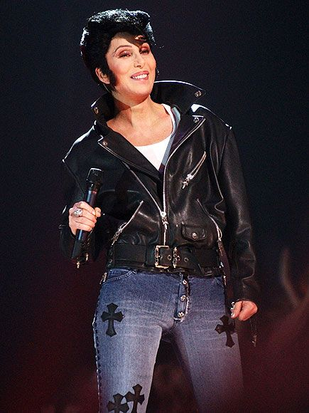
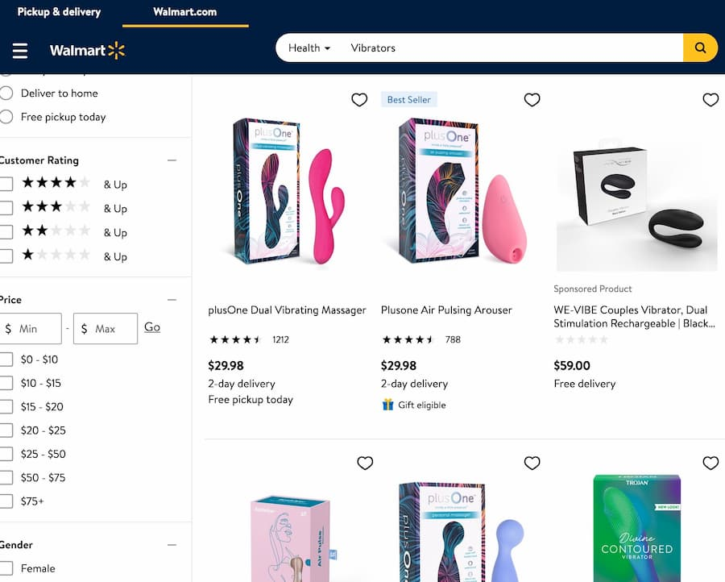
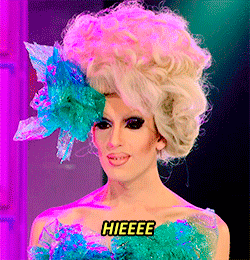

I've stumbled into seeing a few episodes of The Bachelor, and The Bachelorette. It's one of the most distasteful reality franchises I've come across. But it keeps rearing its head. So, if I'm going to watch it, let me share my ire.

This is the first time I've ever sat down to watch a season start to finish.

I'll write my blog posts while watching "live" (a.k.a. on ABC on Roku the day after broadcast) - so it's my immediate reaction. Any subsequent notes or edits I'll highlight.

## Things I know about this season

The Bachelor is the first black bachelor (after 25 seasons?!).

He's called either Michael or Matt. 

He looks like he should be presenting the sports section on a local news show.

That's it.

## Let's get into it...

Is there no intro? Is this a streaming fuckup? It just dives into "I'm wearing a sparkly dress and getting out of a limo". 

She looks "incredible", he looks "great". She's Katie. The pandemic has been hard for her, and she gives him...a fucking dildo? Which ABC has to censor.

Oh...and that was all a funny joke, so now we start.

Chris Harrison on some steps. Chris Harrison is just oddly creepy.

Ok, the bachelor is called Matt.

Everyone applied to the bachelor because it's a fucking pandemic and nobody has anything else to do.

## Let's find out about Matt

He runs topless.

He looks awkward dancing in a sweater.

He's "cool" on a skateboard.

He likes crew neck sweaters. He's a real estate broker and does lovely, charitable, things with kids.

He's arriving in a biplane, for no fucking reason. Although that's quite a rad purple suit and mustard crew-neck combo.

YOU DO NOT HAVE THE POTENTIAL TO MEET YOUR WIFE. Seriously. As I understand it, you have less chance of finding marriage through being on The Bachelor than just accidentally meeting someone.

First mention of Christianity...bleeeeeh. This fucking show and it positioning itself as being all super Christian while simultaneously being all about a harem of people making out and maybe fucking different people over the course of a couple of nights "to find love".

His mom is wild. Slick outfit. Really _natural_ conversationalist. This chat didn't seem at all scripted. I have some vague, maybe imagined, memory of Cher with a pompadour, and that's what his mom looks like.

_LATE EDIT: This is what I mean by the Cher look..._

Third crew neck sweater in the first five minutes.

More topless working out. I mean, I would too if I had what appears to be a twelve-pack.

*Commercial*

## Contestant intros

That property is ridiculous.

Ballet dancing. Boxing. Champagne. Good mask discipline while traveling. Baaaad pleather pants.

Ballet person up first. Hi Alicia! I wonder if they might make just a little bit about her dancing a million times. She'll be towards the final five or six.

Abigail? She's deaf. She has terrible taste in pageant dresses.

Kristin...a lawyer. Who likes a drink. And WAP. And seems like maybe she might have a little too much energy.

Magi. She has a story...which is that she's not from America. Shocking. And some pictures of poor kids to stare at meaningfully.

Anna...it's a hotel, of course you get room service. Chill out. Clearly you're *not* chill about this situation.

Oh, ho ho ho. Sarah asks for Matt from room service. She's on TV locally. Her dad, through his computer voice, sounds less scripted than others already.

...and some other women because there's too many to try and intro THIRTY-TWO (are you kidding me) at once. Peiper dresses like she's 14.

*Commercial*

## Matt prepares for his night ahead

Yes, Matt. Selecting a white shirt to go with a tux jacket is probably the correct choice. And it's actually tailored properly - better sleeves than Chris Harrison, anyway.

The music is so fucking stupid. The Bachelor is absolutely hilarious in how over dramatic it portrays everything. It's a fucking romance reality show, it is not important.

They keep going on about how he *wasn't* on the Bachelorette. Like this show just eats itself alive from its existing contestant base.

...and immediately Matt makes the ladies wait to ask Chris Harrison for his "wisdom". Dick move, dude. While you adjourn to the library?

There is about a 4% chance you're going to meet the woman of your dreams, Chris. I don't know about you, but that's not "phenomenal".

I get the feeling that The Bachelor is gonna be quietly really really really proud of itself for having a black bachelor. Will Chris have some deep racial insights to offer?

"It's a lot."

Nope, guess not.

Matt has commitment issues, in preparation for later drama with someone.

*Commercial*

## D'you want to go and meet the women?

"One of these woman might be my wife..."

Yeah, but let's face it, they won't be.

Fuck, dude. Have a pill or something and relax.

### Limo one

Bri...pretty dresss color. She looks nice and doesn't instantly come across as awful.

How tall is Matt?

Stripper heels for Rachael. Another green dress (I just watched a video about The Crown that said green denotes new beginnings). 

Sarah...some sparkles. She's already talking about "how grateful I am", so I'm guessing she'll be one of the uber-Christian contestants.

Jessenia... "be my rock". OK...bit forward early on.

Chelsea...she's lovely. She looks way too classy and chic for this show. "I want to make history together." "What was your name?"

Mari...pageanty. Some lip filler and a dumb platitude and catchphrase she's rehearsed badly.

### Limo two

Magi is pretty. Has she really come from Ethiopia just to be on the show?

Missed the name of the lady who brought lavender. Good thought, though.

Sydney is forward. 

Kristin...ew, "you've been found so guilty about being incredibly fine".

Anna...again...fucking chill out. The red flag that you gave Matt is for you.

### A truck?

Khaylah drives herself? Is that apropos of anything? Oh...she wants to remind him that North Carolina people drive shitty trucks, so he feels at home? Although driving that in those heels, props for that.

### Limo three

Serena looks like if she turned around too fast her foundation would stay in one place. Nice recovery on the trip, though.

Serena (#2), with the step stool.

Alicia...her personality is "is a ballerina".

Saneh...is this the first furry contestant on The Bachelor. Wtf is with the goat feet?

Alana...ew with the pasta, but also clever to steal the kiss I guess. And she leaves him with the clean up, nice.

### Lingerie and a clothes rack

*Commercial*

Hi Kaili. Both those dresses are heinous. She's doing God's work. Ripped abs, though.

Half the women already fucking hate her, just from the first looks.

### Limo...four?

Stop screaming.

Abigail. She only said she was gonna read his lips, and didn't tell him she was deaf, which feels like it'd sound pretty weird.

Corrinne...she's blessed. It's humbling for him. It's gonna be faux-Christian all the way.

The woman before Emani, can't remember.

Emani, can't remember.

Lauren...awful, awful, awful dress.

Pieper. Something about keeping her name but, oh so lucky, it's the same last name as his.

### Pizza delivery car

MJ brings pizza. From a company that's just called "Pizza company".

### Another limo

We already saw the vibrator at the start of the show.

*And fucking grow up America, you don't need to censor a fucking vibrator.*

I do, at least, appreciate that someone is open about the fact that they like sex for pleasure.

I don't know what her name is.

Now, if MJ the contestant replaces MJ the vibrator, that'd be a fun twist.

A bicycle...ok...

...a fake fish...ok...

Casandra with a "Mrs James" football shirt, which is terrifying.

Ileana...the balls comment...just...

### A gold Bentley

Kit...doesn't like ride shares. A touch of privilege? Best dressed. She looks great, she's gonna be hateful.

### Carried in on a palanquin

No, it's not cinderella vibes.

It's weird to come in claiming you're a queen and look quite that trashy. 

Is she drunk already? (I would be, no judgement here!)

OK, that's all of them, finally. I like that vibrator lady is taking a lead.

*Commercial*

## Everyone mingles

You can have no realistic judgement other than whether you think he's physically hot or not.

Oh, there's an early rose? 

Is Matt wearing a pre-tied bowtie?

Matt gets to meet them all en masse...

...and he asks them all to PRAY? OH GO FUCK YOURSELF WITH YOUR CHEAP, BULLSHIT, FAKE FAITH.

Are they all Christian? Do they all believe in God?

This is a show where 32 woman are fucking throwing themselves at a man to get a bit of a media profile, and the least genuine, least honest, fucking experience ever, and the extent to which they try to connect that with faith - the Christian faith in particular - is so fucking disgusting.

I'm not religious at all, I'm pretty anti-religious. But, honestly, I feel like if you were a real Christian this would be even more insulting.

Is The Bachelor/Bachelorette just a way that Christians can justify mass polyamory and a bunch of heavy petting and screwing opportunities.

So fuck off with your fake prayer, Bri. That was about the least "genuine" thing ever. And people tear up?

Can I just say, the US as a country is SO WEIRD about Christianity?

## First meetings

Sarah with the extra symmetrical face gets a first chat. How long are all these chats, like 90 seconds or something? 

If you were the first black Bachelor wouldn't you make a comment about how fucking appalling it is that you're the first black Bachelor 25 seasons in?

Gag gag gag everyone going on about the fucking bullshit prayer.

Is that the first hand holding and thumb caressing? Rachael is very pretty and I like her earrings.

And a first "Hiyeeeeeee...Do you mind if I steal you?"

Do they ever say "yeah, I do mind actually, I'm having a conversation already"?

*Commercial*

How long is this show?

I wonder if they filmed this before or after Queen's Gambit was so successful, so they could shoehorn in an awkward chess thing.

Mari joins in with the high school craft projects with her fake plane ticket. She brings up the things that are really hard to talk about so that she can talk about them.

And, ok, hehe - the vibrator interruption while talking about the Puerto Rico hurricane, a little amusement for that. But, Katie probably wants to have a little more to her than "holds a dildo a lot". And Mari...Mari was pissssed.

North Carolina has shitty drink options to go with shitty trucks! And not even in glasses.

Ewwww. Victoria and "the queen is here...". Kit needed to just have said "fuck off". And all so that they could have a fucking discussion about the origins of the term "drinking from a fire hose". What's the queen's name? She's...well...heinous, or deeply deeply insecure. Although I guess the rest of them are all too lacking in confidence to tell her "no" about interrupting.

Roseboy pops in with the "first impressions rose".

Did they just beep the word "bitch"?

Thirty or forty minutes of people talking about how much they want to get some time to talk to Matt and doing fucking nothing about it.

Poor masked bar staff. Do they not quarantine? Does that basically mean nobody is really quarantined.

There are THIRTY-TWO women. Does this thing run until about four in the morning? Do they give Matt some Adderall to keep him awake to have more inane conversations.

Abigail will get the first impression rose because she's deaf. Which is as good a reason as any for Matt to be able to differentiate between them. She seems sweet, though.

How many times do you just go with it when someone leans in to make out with you after the first two minutes of conversation?

## First rose time

And everyone around the table when he picks up the rose is like "motherfucker..."

Aw, she's a fighter. She's deaf, so she can be your inspiration porn for this series.

Who is the super bleach blond woman?

## Rose ceremony

Panicpanicpanicpanicpanic, dramatic music, panicpanicpanic. How many roses even are there?

Do you need to say another fucking prayer, Matt?

"These are the woman whose names I've managed to remember..."

Marie...deserves it for a pretty colored dress

Rachael...for the same dress in a darker green, minus points for pretending to cry about the prayer

YOU ARE NOT GOING TO FIND YOUR WIFE HERE

Chelsea...she's lovely

Sarah Symmetrical...bland but unsurprising

MJ...is the rose for the vibrator or the contestant?

Serena resting bitch face...I think maybe you'll go home, too...

Serena P...I can't remember you. Well done.

Kaylagh...for shitty North Caroline memories.

Kristin...she's the lawyer, right?

Kit...for sure.

Magi...unsurprising.

Piper, Laurie, Iliana, Lassania, (Maralynn, this is literally the first time you've had airtime), Kaili. Oh, surprise, Serena resting bitch face stays. Lauren? Sydney? Elena...aw, name confusion...lolz. Vibrator Katie. Crazy eyes work for Anna.

"Ladies, this is the final rose tonight"...WHY DOES CHRIS HARRISON DO THIS? WE CAN COUNT PAST ONE.

Obviously it's going to be Victoria, as determined by the producers for extra drama.

I'm surprised ballerina lady didn't stay, I can't remember any of the other ones. She seems far too normal to spend too long on the show, though.

## Celebration

Let's have champagne!

You are NOT going to find out who Mrs James is...

## Season preview

Matt has abs.

He kisses a bunch of them.

Dramatic conversations.

Contestants I honestly don't even remember from this episode.

...oh, it's the Love Island "late contestants" trick...

And a bit of sex worker shaming, apparently.

And an ex.

And a yoga porn scene that I legit think is already on Pornhub.

Drama drama drama drama. "It's just really hard."

Tearful walk away (remember, we already hinted earlier about commitment issues).

Shirtless emotion! Walking through nature in suits.

Remember, Matt is doing God's work.

See you next week!