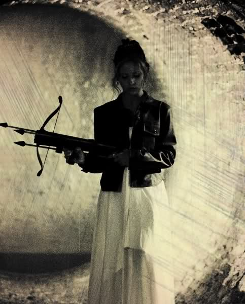
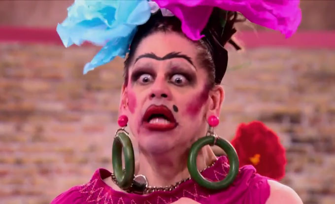
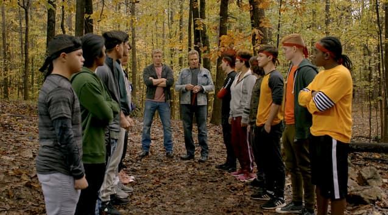
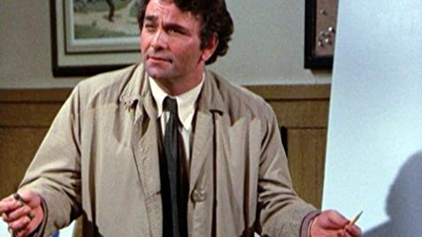
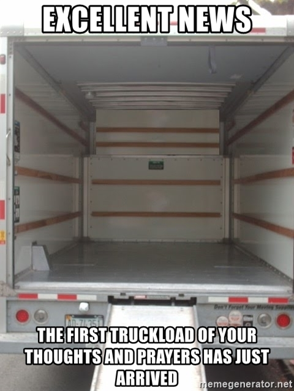

_I'll write my blog posts while watching "live" (a.k.a. on ABC on Roku the day after broadcast) - so it's my immediate reaction. Any subsequent notes or edits I'll highlight._

## Prelude / preview

Someone has a panic attack.

Matt runs. Last night was "everything he could hope for". In the sense that he wants 30+ vulnerable women artificially throwing themselves at him, sure.

Shower scene, because Matt has a twelve pack.

## Wherever the fuck Nemacolin is...

Looks like they've built an awful, generic, golf resort and put it in the middle of some lovely Pennsylvania landscape.

Your "I'm a Queen" was already one note last episode, Victoria.

Chris thinks he's Jason Bourne in that jacket.

We'll have two one-on-one dates, and a group date, and some people won't go on a date. And that's *terrifying* apparently. It will *kill* Khaylah...

The serious chats to camera about the importance of this, when they've known him two minutes...it's honestly terrifying what it implies about the mental state of these women.

Why can't Bri tie her hoodie around her waist or her shoulders? Did she just lose focus halfway through? Hope she doesn't tangle it on the ATV wheels.

Matt going for the tech-bro vest look, and an over-baggy waffle-weave sweater.

"That would be literally my ideal thing" is the comment from one of the other girls about Matt putting a helmet on Bri.

If you did a drinking game where you drank every time you heard "literally" then you'd be dead from alcohol poisoning in six minutes.

## Victorian insights...

Actually, she has a totally fair point here. Anyone saying "oh, I'm happy for x" is crazy false...not that you'd be able to tell their real emotions behind some of this makeup.

_Commercial_

## Off roadin' with Bri

Drive in a straight fucking line, Matt. I certainly wouldn't trust you enough to be a passenger on your ATV, you drive like a douche.

Ho ho ho, he nearly killed them both.

Why not apologise to Bri herself, and not her fucking mom who you've never met?

He's still very tall.

Bri...well...she...liiiiiikes....those abs. He's silly cut, like _chiselled_.

Why is Bri still covered in mud, during the to-camera piece where she's talking about how comfortable she feels having sat with Matt in the hot tub, *where she would have cleaned off the mud*?

Makeout...because this is all about genuine emotions, and he **really** feels for Bri (and the other however fucking many others there are).

## Victoria fucking hates y'all

She's grown on me already. "Queen" Victoria is more genuine than everyone saying "oh, I'm so happy".

## Romantic sunset date

No, that's a fashion miss from Matt, not a good three color combo. 

Bri goes for a very accurate "Prophecy Girl" Buffy Season 1 finale cosplay.

And Bri's mom kept a whole new life secret from Bri? "Hey, dear, I'm gonna go and get married and have a kid with this person you've never even heard of."

Matt goes for the common ground of broken homes, which I feel is probably a strong "good way to persuade you to fuck early, but also pretend it's something to do with my faith and family feeling" staple in The Bachelor.

He then gives a really lame toast.

## Back to Victoria hating y'all

I want Victoria to lead a group date, and everyone else can be all whiney in the background.

Rachael got some top half of the face emotionless botox going on.

## Things that aren't "dates"

Eighteen women doing some dumb activity to impress some guy is a medieval harem, really.

Bri gets a rose and they lock tongues.

The show goes for the really subtle, nuanced, fireworks symbology.

Please stop putting Victoria's profession up as "Queen".

Looks like it's gonna be crazy after the commercial...

_Commercial_

## Dawn breaks

Why did Matt dress for a funeral for this wedding themed date?

What...the..fuck is going on with that photographer? Did he escape from 1973?

Blah blah blah ... potential wife ... blah blah blah.

Oh, is the photographer like "a thing" in Bachelor-world?

_YOU HAVE TEN MINUTES TO GET INTO QUICK DRAG_

I have those same coat hangers.

There's a really impressive lack of imagination going on with those wedding gown choices.

_YOU ARE NOT GOING TO MARRY HIM JESSENIA_

_OR ANY OF THE REST OF YOU_

Serena resting bitch face needs to smile for the pictures.

Someone actually briefly stood up to Victoria. Not long enough for me to remember who, though.

Pleeeease shut up about the royal shit. Although plus points for the garter belt. Suitably trashy, I kinda liked that whole approach.

Kohl's Jason Bourne interrupts us with a very odd sweater vest cardigan thing going on.

## Paintball commando something or other

Capture the...flag/heart. Because, y'know, they have to "fight" for Matt.

It's like the thing from season 2 of Cobra Kai.

### STRATEGYYYYYYY

I kind of like how competitive they properly got, with plans and tactics and stuff. 

I have no idea how someone actually wins this. It kind of turned into a proper free for all.

We "deserved" to win? OK, um...right...

"I just want thank God, my teammates, blah..."

These are some whiny women. Jesus. Stop crying, Katie. You don't even know him.

## Evening date

Kit has really on point fashion game. 

Matt does...not...have good fashion game going tonight (or all episode, really). 

Oh ffs, "I want a man of faith". Because this is exactly the environment for basing your relationship on a bullshit Christian parable you read on the back cover of a kid's bible.

If his faux faith is so important to him, does that mean anyone who doesn't share it shouldn't really bother on the show?

Kit _must_ have rich New York parents who are appalled that she's on something so gauche.

Matt explains some gender roles in a patronizing way...and gets another makeout session.

## Second solo date announcement

Is, to no great surprise, with Sarah, the women with the most symmetrical face on the planet.

She kindly then defines what a solo date is, it's where there's just two of you and you have some one on one time. Thanks, Sarah!

## Victoria gets sparkly...and vulnerable

It's like an honest, real, normal conversation.

At least until "I'm gonna challenge you to continue to own who you are", as Matt throws out something he read on a fortune cookie.

And then Victoria's personal analysis goes insane.

## A Rose for GOD!

> "I wonder what it was that made him vibe with her?"

It was God, ok. It was God. It was God. It was God.

Because a harem on national television is how one demonstrates deep religious faith.

_Dramatically into...commercial..._

A better waffle-weave sweater for Matt today. that burnt orange a little better than yesterday's oatmeal.

Sarah looks exactly how you'd expect her to look. It's pretty cute, I like the jacket. Her little crop top really doesn't seem like it's gonna be especially practical for another action-adventure date, this time it's airborne!

It's fun how they do dates where it's impossible for them to actually talk.

The dramatic Pirates of the Caribbean music is excessive.

Rachael, you need to go on better dates. This is a dumb date, not a special date.

Sarah, you are an adult woman. You do not need to be calling your mom, dad, and family every single day.  Although sounds like your dad is vaguely sensible, if the implication is that he thinks you're stupid for going on The Bachelor.

Detective Matt fights through the blindingly obvious, to identify that hint of "trouble".

This outdoor dining table set features a lot of cheap paper lampshades from IKEA.

I hope that Sarah doesn't have to eat anything at this dinner, her lip gloss is...glossy. Wouldn't want it to be marred at all.

Matt's back with the beige and oatmeal shades. It's a bit generic J Crew. He's not had a good fashion episode.

Sarah talks about how tough it is to reveal something that she literally revealed in her intro in the first episode, and talks about her dad.

> Sarah: "It's unimaginable"

> Matt: "I can't imagine"

Yes, that exchange actually happened.

Wait, so she quit her actual job to be a caregiver for her dad, but then abandoned that caregiving role during a global pandemic to go on the fucking Bachelor? How does that work?

Matt's got some thoughts and prayers...

Even he's kind of thrown as to why she's here. But it's OK, she's rationalized it somehow.

_NB: Not that Sarah shouldn't make decisions based on her needs and not her dad's, but don't make a big deal about how she gave everything up to be his carer when you've specifically given up that care for something as random as The Bachelor._

She has nice fluffy jackets. And she matches Matt on the "I'm in crazy shape" stakes.

## Night's end

Serena resting bitch face has some _banging_ glitter boots, they're fucking rad. She should get a rose just for the boots. 

And wtf is that dress Victoria is wearing?

Matt's catching up with the other women he didn't have dates with. Pawing Abigail's leg like God and his faith intended him to. And Maralynn's leg. And someone else's leg who I couldn't remember.

Seriously, what is Kit doing on The Bachelor, though? She seems so out of place.

> "Thanks for the orchid, is it a fucking rose?"

Oh, shit, Maralynn. You didn't realize that Victoria isn't just a queen, but that she's...**AN EMPATH**!

Matt looks dramatically confused as Victoria confesses just...how...awful...truly...Maralynn is. 

I was convinced. Were you convinced? It was very convincing, don't you think?

Victoria is so so proud of how she threw Maralynn under the bus. Let's just say that the others aren't entirely convinced.

Small bet now - Victoria will stay, Maralynn will leave (because that's way more fun for the producers). Victoria is the reality show contestant who can stay until mid-series just for the drama.

Maralynn is all kind of confused with Victoria. This was a such a fun confrontation. Victoria was just happy to fuck with her completely. Genuinely glorious.

> Maralynn: "I really acknowledge your feelings"

> Victora: "Fuck you, you hateful bitch"

> Maralynn: "I'm sorry if I hurt you"

> Victoria: "Fuck you"

Victoria isn't gonna win, but she is amusingly fucking up a lot of other people's night.

## Rose ceremony

Chris Harrison's primary role to tell people blindingly obvious facts in a non-dramatic way, backed by dramatic music.

I still don't recognize/remember half these women.

Really insightful conversation with Matt in the corridor there, Chris. We'll see you in a couple of minutes when you come and tell as that there's one rose left when we can all see there's one rose left.

> Victoria: "Maralynn needs to go home. Because I hate her."

I kind of think just that comment deserves a rose.

Peiper...ok...you were forgettable throughout the entire episode.

Kit...you are too good / trust-fund-y for this show.

Magi...your personality is still "is from Ethiopia".

Rachael...stopped crying for a moment.

Abigail...cool.

Chelsea...she's knockout.

Jessenia...she tried to take the rose before he asked, which was fun.

Katie...she didn't make an impact this episode, absent a dildo.

Serena resting bitch face...yay, the boots get their deserved rose.

### Fainting!

Sarah's gone blind!

## Next week

Did one of them really suggest it's not normal to have developed such feelings in such a short period of time, in this environment, as a criticism of someone else on this show? Hahahahahahahaha. Isn't the whole point that they go on about how much they love Matt when they've spoken to him for eight seconds?

Victoria fucks with everyone, apparently. Although I don't think they showed her in anything other than her rose ceremony dress, so they're keeping it spoiler free on whether she makes it through for real.

## Postscript

How Matt and Bri played in the mud after Matt nearly killed her on the ATV.

