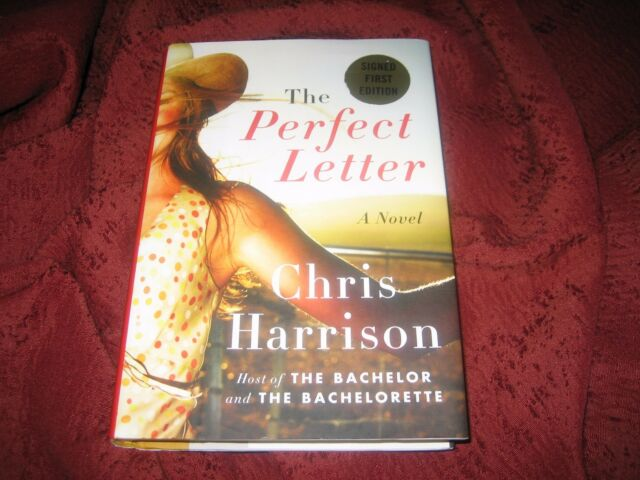
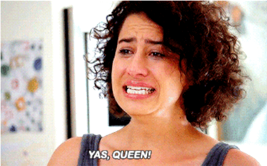
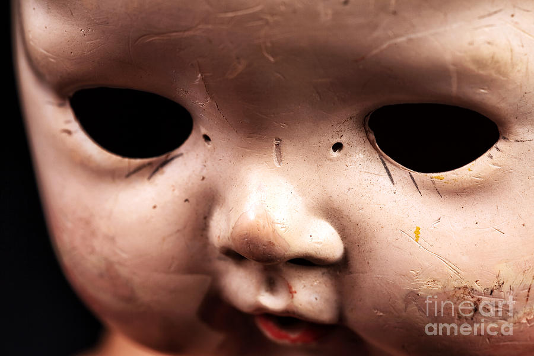
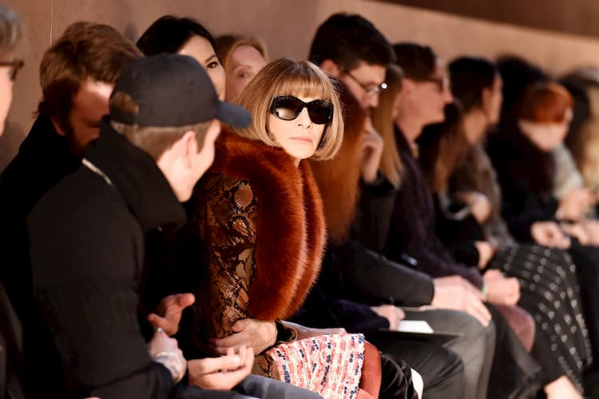
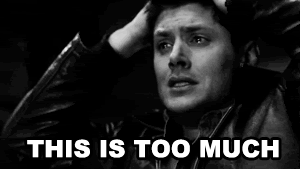

_I'll write my blog posts while watching "live" (a.k.a. on ABC or Roku the day after broadcast) - so it's my immediate reaction. Any subsequent notes or edits I'll highlight._

## Contextless Prelude / Preview

Toasts to "breaking norms", on a hill, and some return to high-quality sweater game for Matt.

...and a donkey.

## On with the show

Oh, yeah, Sarah of the symmetrical face "fainted" from the stress (when she alread has a rose). Victoria smirks. MJ is pissed. Anna, who I forgot existed, is jealous at Sarah's "pure and intense moment" while the entire rest of the group gives her fucking daggers.

Matt says that Sarah's "exhausted". Everyone else calls bullshit. Even Victoria thinks Sarah is being self-centered. 

## More roses...

Matt apologizes, for some reason. It's gonna get soooo tough in these rose ceremonies. So tough that he needs to adjust his tie.

- Khaylah...who said she didn't feel shitty towards Sarah except she feels shitty for feeling shitty towards Sarah
- Mari, she looks like a movie star
- MJ
- Anna...has she done any stuff before?

...Maralynn keeps whining about feeling defeated...

- Kylie (spelling?)

Thanks Chris, we can fucking count. Final rose...stupidly dramatic music. It's not the siege of Troy in some classical drama...

- Victoria, which, while she's grown on me, is obviously a producer choice. 

Byeee Maralynn, you got pwned.

Maralynn does a whole voice-breaking to camera sadness thing.

Damn, Matt is a mediocre public speaker.

I bet The Bachelor uses shitty sparkling wine for their champagne toasts.

Victoria is knives out for Sarah, and I think might have some more support from the rest of the crew this time.

*Commercial*

## Sheeps!

Seriously, Nemacolin looks so fucking tacky.

Chris says he's had a "chat" with Matt, so that he's going to "be comfortable being uncomfortable". 3 dates, 2 group dates, and some special romantic 1-1.

Sarah of the most symmetrical face in the world, also has a seemingly perfect stomach. She reads a bunch of names, is that another stupid oversized group date...it is. It's going to be a "surprise". Anna smiles in a way that makes you feel like she eats her young.

Kit basically **climbs** Matt to say hello.

Matt's outfit is...ok. THe individual pieces are ok, the combo is...I dunno.

## Erotic readings!

Anna "needs a bath" from hearing about someone's lips at someone's ear.

Chris Harrison wrote a shitty erotic novel?!!!!

Kit is correct...cannot picture Chris Harrison writing an erotic novel.

It's also cute when they bring in the tiny minority of people from Bachelor nation who've actually had lasting relationships after the show.

...The "live studio audience" for everyone to perform for must be crew, I guess. Or what's going on with quarantine?

### Awkwardness

Serena resting bitch face says she's super awkward, but actually she seems super smiley about it.

Kit's trying to be classy. Victoria's talking about fucking (at least under the beeps). 

*Commercial*

Autumnal tree flyover, and straight to this cheaply thrown together amateur dramatic set.

Oh, the live audience is just the other contestants.

Matt will presumably be awkward about some of the more risque scenes, because *GOD*.

Sarah symmetry doing that whole ridiculous thing about getting emotional from a realization that there are other women on the fucking show.

Matt is a mediocre writer to go with being a mediocre public speaker. Wasn't it so hot when someone held someone by the shoulders? Who's point of view was that supposed to be from? What was with the weird lip-licking? Why was Kit doing weird lip-licking back?

### And now for some sub-50 Shades

Anna does look like she'll eat her young with that smile.

"The Fantasy Suite". She exposes her breasts...one at a time. And Matt has a big dick, and she'll come quickly. She needs Matt to tell her she won so she can orgasm.

Bri has an an 80s muscle shirt thing going.

Kit has great...delivery...

Serena resting bitch face has a fun outfit, don't remember any of the words.

Khaylah gets racey, at least judging from the beeps.

Rachael with her mom jeans does something tame, and Matt loves it.

Katie apparently going all out, and getting **everyone** hot and heavy. Everyone loves it. God will presumably tell Matt to not commit to Katie, but maybe after he gets a hand job.

Victoria going for some kink. Also, I applaud both her body positivity and her shade to all the other girls. And she got a "Yas, Queen" from Matt.

For me. 1st place - Victoria. 2nd place - Katie. 3rd place - Kit.

Oh, fuck off, Sarah symmetrical. Go home. You've known him a week, so either you're terrifyingly needy or you're just terrifying.

*Commercial*

I repeat. Oh, fuck off, Sarah symmetrical. You're like a child. You felt "dirty", wtf?

## After party

What is Matt wearing? Is it pajamas and a shitty coat?

You don't have to grab the leg as part of the actual motion of sitting down.

It's farcical to be talking about how positive they feel about how the relationship is "progressing".

Also...ew...does Matt have **seriously** dead eyes when he leans in to make out? Run, Rachael, run!

He likes Bri's "application to their date" in her storytelling...huh? I do like Bri's style, though.

**DEAD EYES!** **DEAD EYES!** **DEAD EYES!**

### Date cards

Knocking on a door like a zombie.

Serena not-resting bitch face ("P") gets a date. Will she wear her onesie?

Peiper is over Sarah symmetrical's denial. As are we all!

Oh, jeez, if you get triggered by faithfulness and commitment and you come on a show based around one person getting to screw around with a bunch of people before picking their favorite.

So instead she decides to go fuck up someone else's date.

Katie, just tell her to fuck off.

You're exactly right Victoria, it's disrespectful. You had **ONE STAGED DATE**, Sarah. 

**YES**, Katie. Thank you so much for both coming back, AND standing right there figuratively tapping your toe. 

Also, Matt, fucking grow up and show Katie some respect.

The other women will think that you're a needy, scarily insecure person, Sarah. And, indeed, they're absolutely...and rightly...completely blunt with her.

Oh, Victoria, I fucking love you;

> "We were super worried because we thought it must be really serious, because you're not just a malicious person..."

And Katie totally on point. Sarah is both symmetrical and super selfish. 

Early bet - Sarah will get the final rose over Katie tonight.

Kit is **SOOOOO** much more polished than everyone else. The rest are at a sorority meeting and Kit is at New York Fashion Week.

Rachael's mom jeans and tame reading unsurprisingly wins her the early rose.

Zero marks for Matt on this group date, for not even standing up for those women's time. He is a *WEAK* Bachelor.

*Commercial*

We get it, we are at Nemacolin, and they've clearly paid a lot for their product placement...

## Group date post mortem

Katie is unimpressed.

Though, Katie, you are far too confident in your sexuality for Matt to have given you the rose. He's too weak to give a rose to a confident woman.

Oh, Serena P is peppy Serena.

Oh, jfc Matt. You're gonna run off to Sarah? Talk about shitty behavior to everyone else.

And, Matt, if you really just want the super needy, dependent, choice, and that's your desire, then politely say that to everyone else and treat them with some respect.

Sorry, MJ, Matt has done a bunch wrong. He's handling this appallingly. And, as Victoria rightly points out, it's Serena peppy's date. 

You're a dick, Matt.

*Commercial*

## Horsey date

Are they both riders?

Serena Peppy is really peppy.

> "How do I make a cheese board?"

Piss off, Matt. Really?

Serena Peppy - your dad is, of course, absolutely correct to be not supportive of this. Sure, you're right, "to each their own", but going on The Bachelor with any actual expectation is stupid.

Hah - if Matt did some unconventional living or broke a norm, I think he'd have an aneurysm.

Serena Peppy has a nice smile. The donkey knows that she can do better than Matt. Thankfully, she's also smart enough to not fall right into the "I'm falling in love", and just says she likes him.

## Scaredy symmetrical Sarah

She hid in the room all day? Wow. Girl has some issues, for sure.

Serena Peppy looks freezing in that dress making their way to their dinner date.

Matt pulled together his fashion game for this date, both day and night looks.

Why do they serve food on these dates, when they just sit there and never touch it?

Matt, without realizing, I think makes pretty clear that he's scared of commitment. Might lay a couple of dollars that he chooses not to propose to someone at the end of all this shit.

Matt has the same fucking lines for everyone. "I always enjoy spending time with you. I remember the first time I saw you, I remembered you."

Props to Serena Peppy for looking pretty chill on the whole date, though, and kinda sitting back and letting Matt do more of the work.

Won't that hot tub get kinda manky if Matt gets a hand-job in it after every date? Is Serena Peppy still wearing her dress?

## Shade for Sarah

Sarah symmetrical face still hasn't come downstairs. Kit's not missing her. Everyone hates her. She's given them a whole day to stew on everything. And then she slides in and tries to steal sweet Bri's warm throw!

Serena resting bitch face is now Serena stab you in the face face.

I already said Anna will maybe eat her young, so I have no doubt that she'll eat you.

> "Calculated"

> "Manipulative"

> "Toxic"

> Victoria: "Yes, you're all those things. You're a little bitch."

I like Victoria so much now. 

And Kit...Kit fucking destroyed girls in high school with a look. That was sub-zero.

## Next morning

Katie, you're far too nice. What are you doing?

And, fuck, Sarah...as I said last week, if your dad has potentially weeks left to live, what the ever living fuck are you doing spending time on The Bachelor?

...I kinda don't think she'll leave, still.

Kit, Victoria, and Serena resting bitch face would be the most terrying trio of high school social climbers. But in a great way.

### Sarah punches back

Sarah goes to see Matt with a woe is me look. And cries about how mean everyone was.

See above...

> "Calculated"

> "Manipulative"

> "Toxic"

Oh, she's prayed about it. And thought about it. Which means "I've thought about it" twice.

Looks like she might actually be leaving for real.

...wonder if it'll be permanent.

Even the most intense holiday romances when you're a teenager don't fucking end with this much woe. Go home, Sarah, you shouldn't have come.

## Next week

More contestants...because it's not like we already have too many.

> Victoria: "Who are these hoes?"

Which is fine as a throwaway comment. But then we jump straight to Anna heading into shaming sex work, which is not fucking cool.

## Epilogue

Matt even hiccups weird.

