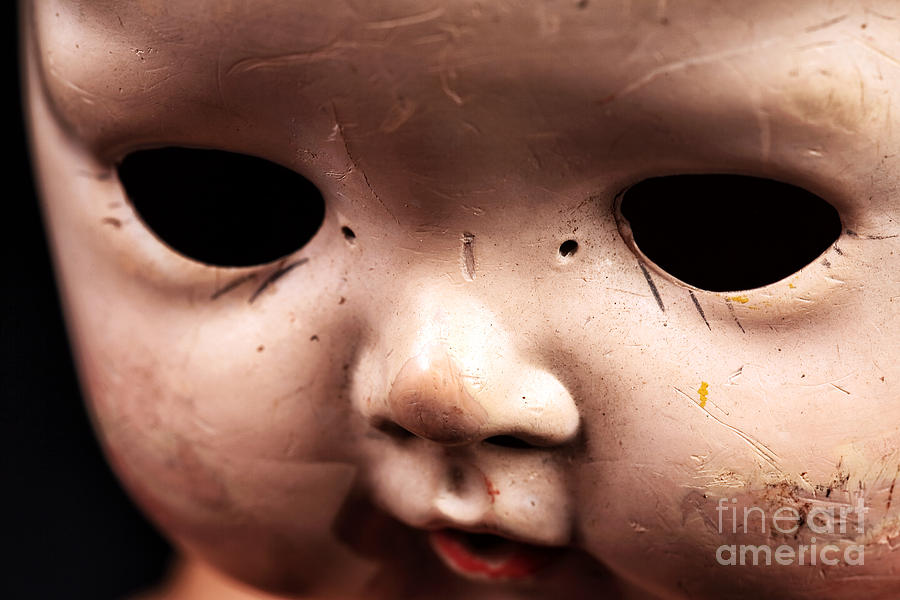
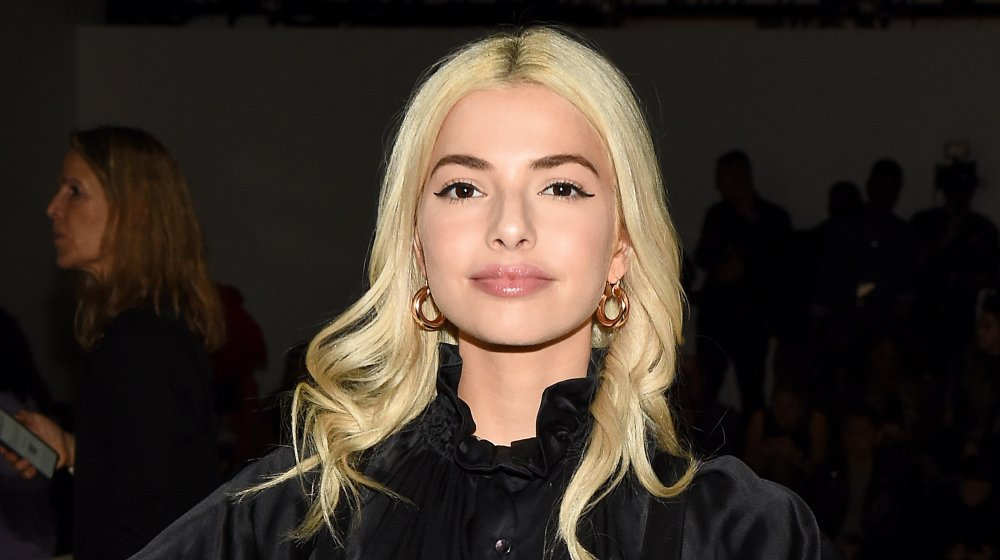
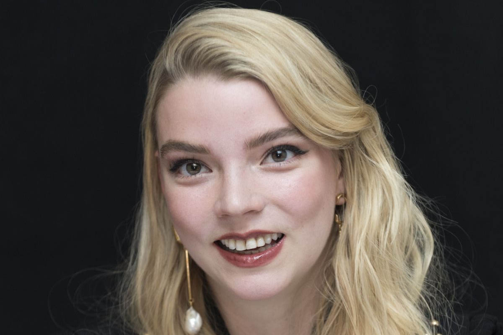
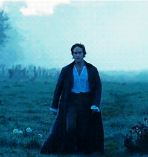
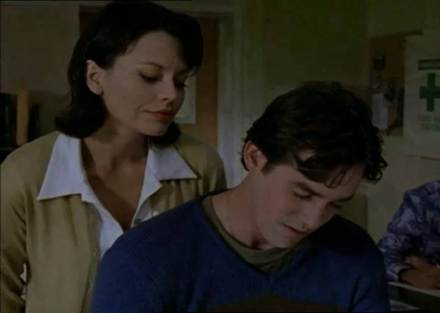
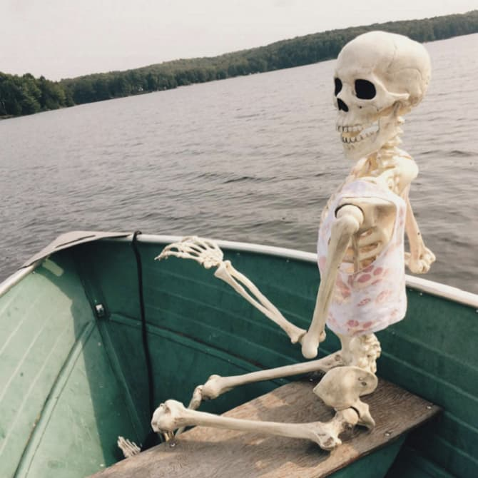

_I'll write my blog posts while watching "live" (a.k.a. on ABC or Roku the day after broadcast) - so it's my immediate reaction. Any subsequent notes or edits I'll highlight._

## Prelude / preview

We're kicking right off with Anna doing some sex worker shaming, so get ready for that, I guess. :/

## Matt's apartment

Matt is _hurting_, boo hoo, because Sarah symmetrical face decided to leave. He's perching precariously on a railing in his lumberjack jacket and black hoodie. All so emotional.

The women are _not_ sympathetic. Anna's forehead is _very_ shiny.

Katie's decided that Victoria is toxic. Which is weird, because she was totally cool with Victoria being mean to Sarah yesterday.

## We're on to another group date already? 

Mari's dress is...a choice. Also, all the women are in skimpy dresses and Matt's wrapped up in a windbreaker while he's inside.

MJ wants a moment to chat. She, sincerely, wants to know how Matt's doing. Matt, well, he's being **real**. 

Later, he worries if the women can handle just how **open** he's being. He's focused on Mari...and maybe Mari's puffy sleeves.

Sweater game today...middling.

The women are allowed crappy polaroids to take selfies. I assume because they're not allowed cellphones.

Chelsea with hair...woah. She's so chic with her super short hair. But I really love that she has a few moments to talk about black women and their hair, and how important it is.

**DEAD EYES!** **DEAD EYES!** **DEAD EYES!** 

They make out.

## Victoria on the downslope

Having used Victoria to get rid of Sarah, the producers are now pretty clearly setting her up to be portrayed as truly heinous.

It's a weird conversation. I do think Victoria is super insecure, though, and Katie is pretty false behind that bubbly "oh, look at me and my vibrator" innocence.

## Date rose

Why does he lick his lips like a fucking creepy Buffalo Bill serial killer before he offers Chelsea the rose?

**DEAD EYES!** **DEAD EYES!** **DEAD EYES!**

*Commercial (preview into the commercial shows that the show as a whole is totally buying into sex worker shaming)*

## Time to prep for a rose ceremony already?

It's a bit weird having it so early in the episode.

Peppy Serena looks lovely tonight.

> Matt: "I came into this looking for a wife."

Oh, fuck off, Matt. Either you're deranged or you're just a liar.

The more episodes into this show I get, the fucking ickier the dynamic between Matt and the women becomes. Like, all their conversations, especially from Matt's side, are genuinely _creepy_. It's so stilted, it's like they're talking to a robot.

To reinforce the point, he makes out with Pieper **with his fucking hand around her neck**.

## Was Kit in The Queen's Gambit?

I think her voice, in particular, reminds me of Anya Taylor Joy.

## Bland platitudes

> "You're your own woman."

> "What I feel for you is real."

> "The more time I spend the stronger the connection is growing."

Everything he says could apply as a pointless comment to literally every single woman he talks to. He could copy + paste them into every date.

## Mysterious Chris Harrison interruption

Victoria is irritated. And Chris and Matt walk purposefully through the hotel lobby for dramatic effect. 

All the women think Sarah is back. But actually, it's just some more women, because it's not like we don't have enough already.

It's like a super early, lame, version of Love Island's Casa Amor, where they throw some extra competition into the mix.

Brittany is "hey", and gives a slightly drunk seeming make-out.

Victoria feels "disrespected"...huh?

> Victoria: "So you're coming in as a backup?"

Strong shade.

> Brittany: "Save the best for last."

Strong-ish comeback.

Unfortunately, Victoria then dives right into "slut, whore" shaming comments, which is disappointing.

**WHO IS BEING DISRESPECTFUL, ANNA?** She's, for some reason, pissed at the other girls, and not the producers.

Kimberly seems super awkward.

Catalina, Miss Puerto Rico, wants to be the "queen of your world". Barf barf barf.

And then Victoria steals her crown, which was kinda funny, but also cruel. Definitely they've flipped the portrayal from "funny, shady, Victoria" to "hateful Victoria".

## Anna will eat her young

They're seriously talking about fairness? I mean, I get that you'd be pissed as a contestant, but projecting all their aggression to those women is pretty fucking pathetic.

Catalina has taken her crown back, though.

Does the number of roses stay the same?

Anna says she **knows** Brittany from Chicago, and that she's sketchy. And we know from the previews she's hinting at some sex work shaming.

Victoria finally gets to finish her conversation with Matt, and Brittany is confident enough to be like "heeey" (and also polite enough to let the other conversation finish).

Khaylah is...triggered? I still don't get it - if you're triggered by lack of commitment or a partner potentially playing the field **WHAT THE FUCK ARE YOU DOING ON THE BACHELOR?!**

### Matt laughs like a real human person

Matt chatting with Michelle, and actually that is probably about the most natural, cheerful, reaction he's shown in the entire season so far.

Oh, yay, no new roses added. At least we don't have to worry about stretching the season out with eight billion women.

*Commercial*

## Rose ceremony

Seriously, chill, Anna. She looks **so** angry.

Matt confides his confusion to Chris. Who helpfully nods, like "yup". And kicks Matt in to give our his roses.

> Matt: "Trust the process."

Hahahahahahahaha.

- MJ, first up with a rose
- Pieper, she's had some time and she's wearing a rad pantsuit
- Bri, no cool 80s fashion looks this episode, but still thumbs up
- Magi, still "from Ethiopia"
- Michelle, yep, that was an honest laugh from Matt earlier
- Mari, despite her whining
- Ryan, which I don't really get, but meh
- Kit, I still don't know why you're lowering yourself
- Serena resting bitch face, bring back the awesome boots
- Abigail, about the only reasonably nice person so far this episode
- Katie, cheery, funny, false...
- Victoria, they need to build up the nasty portrayals a bit more before they eliminate her
- Lauren, ok...
- Brittany, confidence goes a long way
- Jessenia, who looks very pretty tonight, although barely memorable in the series so far
- Anna, because Matt was probably worried that she'd leap across the room and stab him otherwise

Chris does his one job. The music is ridonculous.

- Catalina, to some surprise.

Khaylah deals with it more maturely than half the women who were actually given a rose.

*Commercial (and more hinted sex work shaming)*

## The morning after the night before

Chris is here to talk some bullshit, in a not very well fitted zip sweater.

Group date, "let's fall in love" (with about twelve women at once).

## Some frat-bro-douche...

Oh, a previous bachelor. 

Matt can't count (the number of roses didn't change, so you didn't end up with "more women" after the ceremony). His flannel shirt and hoodie look is really lame, and overdone.

> "You gotta continue to be just your real-est"

Thanks, Ben Higgins. I see from a quick Google search that you split up with your "winning" contestant pretty promptly. You also seem like a moron.

## That's not how you spell "Squirrel"

What the ever-living fuck is this? They're rowing...pumpkins?

Magi is marooned in the water. She's from Ethiopia, you know.

The "find an acorn" contest seems entirely random.

Mari wins the entirely random contest. Victoria and Anna say they're happy the "OGs" won (OGs from less than a month ago).

*Commercial*

## After party

There's a nameless extra in the 1980s movie Romancing the Stone that Matt's outfit reminds me of tonight.

Brittany steps a bit too far (I think), and fair play to Anna she does rightly say no. Matt...let go of her leg. You can talk to a woman without fucking pawing at them.

You can almost see the producers pushing Brittany out there with cattle prods.

Victoria with the slut-shaming comments again. Real shame.

## The rumors...

And now Anna says "oh, everyone in Chicago told me to watch out for her", suddenly.

And that takes us on a dive into a not funny, very very gross, place for this show. 

## Back at the ranch

Michelle gets the solo date. Which is entirely expected. And also chosen by the producers, so I dunno why everyone is getting so salty.

## Bri is lovely

She seems less heinous than most.

He's gonna give the rose to Brittany, isn't he...?

Yeah, Bri is sweet and, I guess, deserves (assuming she wants that) the chance to spend more time with an incredibly lame dude.

## Now it gets disgraceful

Anna jumps in with the escort accusation. And that she wants to know if Brittany has "pure" intentions.

And, look, here's the fucking thing... if she were an escort it would be absolutely fucking fine. Sex work is work.

**IF YOU ARE ON THIS SHOW YOU ARE ENGAGING IN SEX WORK**

To attack another woman for engaging in a "contractual relationship with men" when you are on The Bachelor is such hypocrisy.

Anna's behavior (and also Victoria's response) is genuinely despicable.

And Serena resting bitch face jumps on the "well, it's just a rumor, but let's slut shame anyway" gossip train, too.

_Even staged for dramatic purposes, the message here should be absolutely unacceptable_

## Date with Michelle

All of which leaves a very nasty taste in the mouth before we switch tracks and go to the solo date.

Matt's response to Michelle on the first night was definitely the most natural he's seemed in the entire show, so maybe there's actually something here.

I like Matt's pink knit t-shirt a lot.

Yeah...they actually seem genuinely a bit sweet on each other. It's a lot less stilted than some of the other conversations. Matt actually seems a bit less lame in Michelle's company.

Even having to look over the awful architecture of Nemacolin doesn't seem to ruin their mood. Meanwhile, some of the other women "just happen" to be on the roof with binoculars.

Is the camera guy cramped in the hot air balloon with Matt and Michelle super awkward at this point?

A million times more believable as a connection than anything else in the show to date. Gonna be a stretch to pretend there's much contest if this keeps up.

*Commercial*

## Bitch fest

They are so pointlessly salty towards the new girls. Fuck off MJ with your "deserves" a date, it's so stupid.

Victoria is just being lamely horrible.

## Solo date night

Matt's favorite part is "when you walked up". "Time with you flies by." He really is Mr bland platitude.

Why are they dining (or, at least, sitting near to food) in a classic car showroom?

He actually asks a real question asking about her career. And Michelle also talks about George Floyd and addresses the difficulties that environment creates for students.

Oh, yeah, Matt does do volunteer stuff with kids, too. And they share a Maya Angelou quote. Even Matt notices that it's a more natural experience.

Michelle seems very happy.

And they even manage to finish the night not in the fucking hot tub.

*Commercial*

## Brittany is insulted

...and rightly so.

Not that you would expect it from a show like The Bachelor, of course. But there is a real opportunity here also to address that a) the rumors are false, and b) if the rumors were true, that would also be OK.

## Muscle montage

Matt does some Rocky training stuff in the woods.

**Do not call a potential partner "daddy"**

The training group is...interesting.

Rachel and Serena RBF look good.

Saying you want to hit someone just because the producers brought them in later is sketchy, though.

### Katie vs Jessenia

Katie is not messing around. She was not kidding about getting some aggession out! 

Katie wins.

### Serena RBF vs Kit

Kit did not seem like she wanted to be there.

### Rachel vs Pieper

Dunno who wins

### Peppy Serena vs Lauren

Lauren clocks her right in the face, and they call the fight.

Why make people box if the intent was for nobody to get hurt? I don't even know what the final fight was supposed to be. Chelsea vs MJ?

## After party

Bland Matt toast.

Purple check and mustard works OK as a jacket and sweater combo.

Rachel and Matt have some time together, and Rachel straight out asks for the rose.

**DEAD EYES!** **DEAD EYES!** **DEAD EYES!**

Seriously, he keeps his eyes open when he makes out, it's creepy.

Pieper gets all giggly and hopeful.

**DEAD EYES!** **DEAD EYES!** **DEAD EYES!**

## Back with Anna and Victoria

Behaving despicably. Not just mean girls drama. Slut shaming.

## Back with the girls on the date

Katie is totally right. Stop with the digs and get over it. I thought she was being false earlier in the episode, but I think that she stood up against some shitty behavior and bullying.

It is worth pointing out, it should not be Katie's responsibility to resolve bullying. It should not be Matt's responsibility to resolve bullying. 

ABC, Chris Harrison, and the producers on the show, are the ones who should be taking responsibility to resolve bullying.

Anyway, next week...

## Drama drama fakeness

Well, looks like they'll play out the bullying as much as they possibly can, for the drama. Not cool.

## Epilogue

Magi isn't just from Ethiopia, she's also absolutely a top, and tells Matt exactly what she wants him to do.

Matt absolutely cannot dance.

