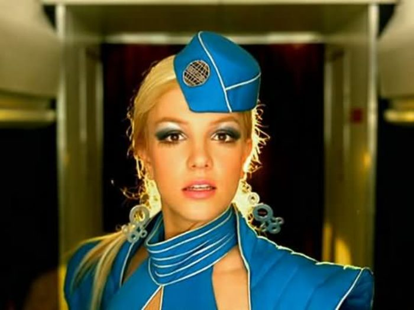
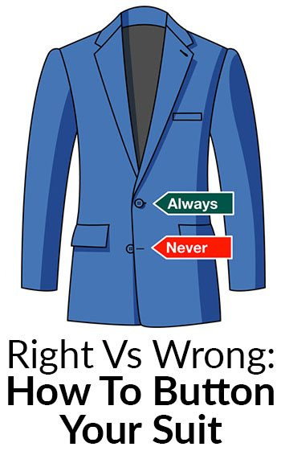
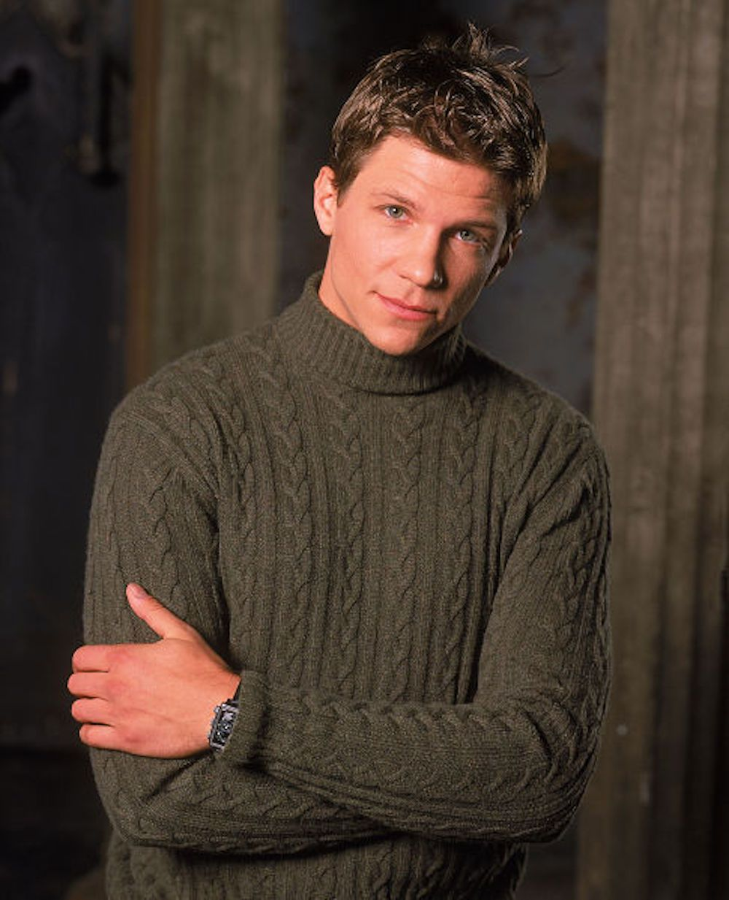
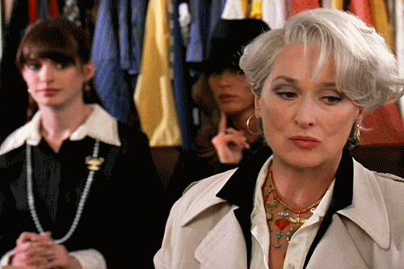
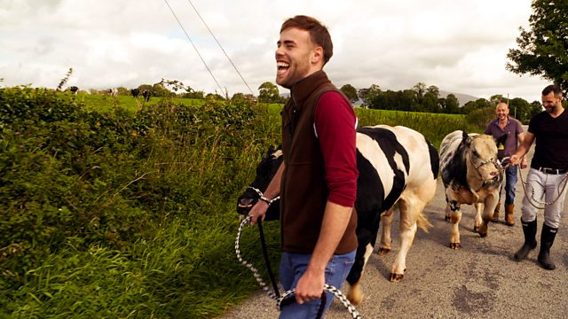
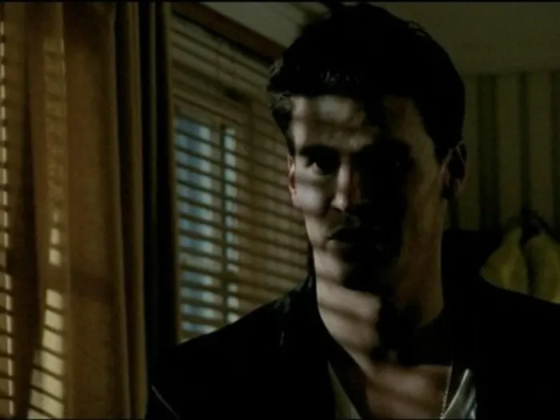
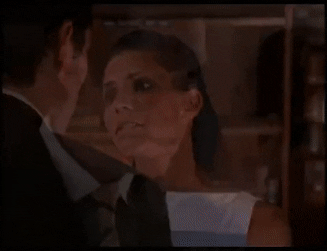

_I'll write my blog posts while watching "live" (a.k.a. on ABC or Roku the day after broadcast) - so it's my immediate reaction. Any subsequent notes or edits I'll highlight._

## Some reference pieces useful after last week's episode

- [The Nation - Let's Call Sex Work What It Is: Work](https://www.thenation.com/article/archive/lets-call-sex-work-what-it-work/)
- [Teen Vogue - Why Sex Work Is Real Work](https://www.teenvogue.com/story/why-sex-work-is-real-work)
- [ACLU - Sex Work is Real Work, and it's Time to Treat it That Way](https://www.aclu.org/news/lgbt-rights/sex-work-is-real-work-and-its-time-to-treat-it-that-way/)

## Prelude / preview

"Literally, torture".

Oh, we're seeing Victoria crack. Though she probably won't literally die.

My guess - Victoria and Anna will both go home, one of them before the rose ceremony.

## The "O.G.s" vs "New Girls"

Not that Victoria didn't set herself up to look awful last week, they're clearly setting her up to look especially awful. Though Anna certainly looked worse.

> MJ (to Anna): "You did the right thing."

Sorry, wtf, MJ?

## Aaaaand straight into the rose ceremony

Anna looks uglier for having been meaner. Doesn't always happen, but does happen here. It doesn't happen with Victoria, she looks as good as she has done so far.

### Toxic!

Matt doesn't want people to belittle other people, and he's...mildly vexed.

At least he asks to talk to Brittany first.

Anna is TOO LATE TO ABORT!!! 

Katie is uncomfortable...though she shouldn't be. She should tell them outright that she did it.

Brittany somehow pitches her story to Matt that Anna brought up the escort story as an apology? She is, legitimately, upset.

Once again - **THIS IS NOT SOMETHING THAT MATT SHOULD ADDRESS FOR DRAMATIC PURPOSES**. It's something that ABC, and the producers (including Chris Harrison), should be addressing immediately.

MJ thinks there isn't a toxic environment, which is deranged.

### Matt and Anna chat...

There's crying.

There's other people crying.

We're dramatically heading into...

*Commercial (after which Victoria probably won't "literally" die)*

Back with the women. Anna "just made a mistake". 

Let's also reiterate - **EVEN IF IT WERE TRUE, THERE WOULD BE NOTHING WRONG WITH BRITTANY BEING A SEX WORKER**. The rumor is awful to spread, but so is the ongoing implication that there's something wrong with being a sex worker.

If you are a contestant on The Bachelor, then you are a sex worker.

Anna says a bunch about how it isn't like her. Matt's response is that he has "a responsibility to myself to follow my heart."

And he kicks Anna out!

It's played as something tragic, but it's really not. It was sex work shaming, it was bullying, it was despicable behavior from Anna.

The Bachelor is using bullying and slut shaming to boost ratings.

On a less serious note...is Anna's outfit supposed to be from a disco scene from the 1970s Buck Rogers show?

## Some home truths

Anna's expulsion at least triggers some discussion among the women and a few apologies.

Serena RBF is pretty clear that it's bullshit face-saving, which I think is pretty much on point.

All the apologies are desperate measures after Anna got thrown out. They're all "oh shit, this could happen to us".

Ryan is very clear about how Victoria behaves, and Matt is just so shocked. He also still paws her leg, because that's supportive.

Victoria snaps back hard. She's an odd one. **LIT-U-RULY**. Her dress is banging. She looks fantastic, if nothing else.

*Commercial*

## Hiyeee, Matt

Victoria taking preemptive action. She's straight there to chat to Matt, and about how it's all ok and in play...

And Matt also lets slip..."when Katie came to talk to me last night".

> "I was curious, what context would calling someone a hoe be taken in?"

...absolutely right, Matt. And I'm very happy they did make that point - words fucking matter.

Victoria actually doesn't seem to get it. And she is, to no surprise, pissed at Katie.

She doesn't seem to have many allies left.

Peppy Serena isn't looking so peppy.

I'm really curious which producer is sitting there nodding and being all sympathetic with Victoria while she rants outside on the step.

Once again, she will not literally die. Though...if you were doing the "literally" drinking game, Victoria might kill you.

## Straight to the rose ceremony

I think I'm 50/50 whether he'll actually send Victoria home, or if they'll keep her for more drama. Though, honestly, she is all over the place...but, hey, if ABC will shame sex workers for viewers, they'll happily film someone having a panic attack.

- Brittany, for obvious reasons of sympathy if nothing else
- Ryan, ditto
- Rachel, who he seems to like for some reason even though she's kinda like a K-Mart Rachel Weisz
- Peppy Serena, who looked lovely earlier last episode
- Magi, who's now not just from Ethiopia, she's a top from Ethiopia
- Kit, you are still too good for this
- MJ, I'm surprised they're keeping her relatively central

(the big exhales from Matt are hilarious)

- Jessenia, who is beautiful but bland
- Katie
- Abigail
- Chelsea, thankfully, I was worried she was getting left late in the game there

**WE FUCKING KNOW IT'S THE FINAL ROSE** Seriously, **WHY** does Chris Harrison do this little bit? What purpose does it serve?

- Serena RBF, though she's coasting on those rad boots from a couple of episodes ago

Matt, it's a nice suit, but learn how to button a jacket.

Damn, Victoria. You were awful last week, but that was a fucking epic exit, I really liked it. I kinda hope she isn't as bad as she looked and is just a really really good actress.

*Commercial*

## The morning after the night before

Chris' zip up cardigan game is pretty shoddy again. 

Chris wants to "shed the drama" (which he supports as a producer, obviously).

We're past the halfway stage already? Damn. And there's still about three hundred women left.

## Dates time

Rachel? Again? Or, at least, it feels like she's had a solo date even if she hasn't already, because she's quite boring.

Hi weird-voiced man in gloves, you were very natural.

Pieper plays either volleyball or lacrosse in college, surely.

Rolls Royce, because The Bachelor is nothing if not entirely unimaginative when it comes to what opulence is.

Matt is doing Riley Finn cosplay.

(from [Woman in Revolt](https://www.womaninrevolt.com/fuckboy-of-the-month-riley-finn/) website article)

The first dress Matt's "celebrity stylist" friend picks out looks awful on the rack but actually quite lovely on her.

Matt is a fucking useless shopping partner, though. If everyhing is special, then nothing is.

That tux jacket and...white cummerbund...atrocity was...um...a choice.

Oh, red soled shoes, Louboutin! Or, a knock-off, I guess. 

Rachel, you do realize that Matt didn't buy this shit for you?

Everyone looks really impressed, except Chelsea and Kit, who seem to actually be involved in the NY fashion scene. Because...sure, whatever, I guess it's kinda fashion, but a bit off the rack, y'know?

Weird voice glove man brings another box which is the evening gown (presumably).

*Commercial*

## More dates!

No shit, more time would be better than less time.

...well, except that Matt is quite dull.

The group date elimination means Kit is getting the solo date. 

NB: The producers pick the date.

## Eveningwear

That is a lovely dress, and a lovely blue. 

Matt's suit is also lovely, though once again...

Oh, wait, I thought it was a lovely suit, but actually it would be lovely if it were all blue velvet, and not a blue velvet jacket and some too-skinny black pants that just look lame paired with it.

> Rachel: "I don't have a lot of confidence in myself."

Well, of course not, Rachel. They wouldn't cast you for The Bachelor if you did.

Matt is attracted to the insecurity (quelle surprise). He gives a few completely transferable bland platitudes.

Rachel doesn't know if she's going to win The Bachelor and go home with Matt.

### Back with the women

Michelle is, probably reasonably, pretty confident about the group date. She was a million times more natural with Matt compared to any other interaction he's had in the series so far.

### Can you say "completely stilted"?

Sitting at the table, Matt and Rachel look like a couple who've been married for fifteen years, don't really like each other any more, but can't be honest enough to have a conversation about how they need a divorce.

Matt, meanwhile, says he's falling in love with Rachel.

But...those eyes are still open...

**DEAD EYES!** **DEAD EYES!** **DEAD EYES!**

*Commercial, with preview of MJ drama*

## Group date

There's a man shoveling poop!

Oh, dear god, they're gonna make them work on a farm.

...there's [a whole BBC dating show](https://www.bbc.co.uk/programmes/p056fjcg) about this, which is way more fun.

That is not how to move a wheelbarrow.

That goat is ready to fuck MJ up. It can probably smell the desperation.

Is MJ like the antichrist, where animals run in fear?

Matt is supportive of MJ's chicken fear, and MJ is supportive of Matt's egg throwing capacity.

But she's NOT supportive of Pieper taking the initiative and making out with Matt. He may even have had his eyes closed!!!

Serena RBF looks like an absolute natural in an agricultural environment.

Michelle is not loving the group date environment quite so much.

### Showered after the poop shoveling

Abigail is also starting to get a little too weepy for missing out on five more minutes with Matt.

Matt's purple sweater is mid-ranking of his efforts so far.

Chelsea, you're not falling for Matt. That was barely convincing. You're honestly a little out of his league.

"I feel comfortable around you" is Matt's #1 "I can't think of anything to say as a compliment" go to.

**DEAD EYES!** **DEAD EYES!** **DEAD EYES!**

Pieper rocks a mint satin pantsuit.

What is it with Matt's immediate reach over to grasp a thigh the moment he's sitting with a woman?

Oh, Abigail...your biggest fear is that you'll DISAPPOINT Matt? But you're so lovely, and so kind. And your dad left because of your disability? And you fear passing on that disability to your children? That's some fucking heavy stuff.

Matt is intensely bland, and leans in for an open-eyed kiss.

**DEAD EYES!** **DEAD EYES!** **DEAD EYES!**

## Thoughts

Michelle started off in a one on one, and now she can't get her head round the group date environment.

She calls Matt "someone you're falling for"... **you've known him a week!**.

Oh, there's a thumb caress to go with the leg pawing. But in this case, they're actually into each other, and Matt CLOSES HIS EYES AGAIN!

He's so much more into Michelle than anyone else.

But Matt still also needs to stand moodily in front of a blind, in shadow, and then sit down and grab MJ's leg.

MJ says (very angrily) that she brings peace and harmony.

MJ is very pissed. And she wants to know who sold her out! 

I like Serena RBF's dark lipstick.

MJ is then crapped all over by Jessenia, who is not taking any shit at all. And she laughs at MJ's request for an apology. And then Katie jumps on it, too. Both clearly highlighting that MJ is totally deflecting. Big extra props to Jessenia, she went from beautiful but background to showing some real character.

## Rachel gives some wisdom to Kit

> "Oh, won't there be just sooooo much pressure on your date?"

"Dinner at my place?" does not warrant an "ohmigod that's so cute". 

## Roses for Abigail

Chelsea's look...oh...she is unimpressed.

MJ is going to "clear up, real quick" the questions about her character? By doing what? Punching Jessenia?

*Commercial*

## The solo date

Matt...you are *not* on your fashion game to Kit's level. Ever. And don't pretend you fucking dust yourself.

Kit has kind of dressed down for him.

Who the fuck orders dessert first at a restaurant? A sociopath?

You may say it "feels natural" Matt, but your making out most assuredly does not **look** natural. Damn, have either of y'all ever kissed before?

Kit is 21, how many years has she actually had when she talks about building up walls "over so many years"?

"It looks like tonight" is very confusing for Matt. Matt is not the smartest of men.

Kit, what are you even doing on this show? I have no idea if I'd actually like you if I met you, but you are far too classy for something as trashy as The Bachelor. Also, at 21 and flitting around NY fashion society, why on earth are you trying to get married?

## Pre-cocktail dramas!

MJ and Jessenia prepare to face off.

They both look pretty rad in different ways. Dress to impress in some military or 70s action inspired looks.

There's one rose dramatically placed between them.

Remember, kids, MJ only preaches harmony and peace.

> "Are you done?"

Jessenia is pretty calm about the whole thing.

Matt rolls up in his red porsche (?) to shitty dramatic music.

Aaaaand...

## Next week

A bunch of poorly defined drama.

Serena RBF takes on Katie.

A fairground.

A frat douche who presumably was on The Bachelor at some point in the past.

Some bullshit contrived "oh, what a surprise" visit from Heather...a Bachelorette from the past?

## Epilogue

The same challenge as the acorns and squirrels from last week, except with a horseshoe and goats.

*NB: Also, my guess about Anna and Victoria was dead on. Yay, me!*

