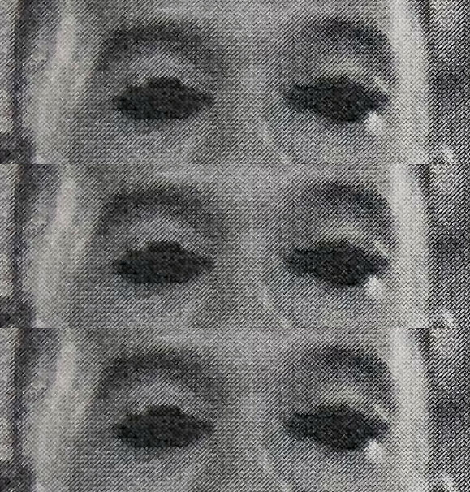

_I'll write my blog posts while watching "live" (a.k.a. on ABC or Roku the day after broadcast) - so it's my immediate reaction. Any subsequent notes or edits I'll highlight._

## Prelude / preview

Some lady called Heather wants to talk to Chris Harrison. Chris pretends to be surprised. "What the hell is she doing here?"

## The MJ / Jessenia show down

Oh, yeah, that happened from last week. Katie says that MJ is "the last of the mean girl tribe" - which shows how quickly the producers set that up for drama and then shut it down.

Matt was driving up in a Porsche, for no particular reason.

MJ and Jessenia are having the dumbest "no, you stop talking" discussion.

Matt does his usual exhale. He's "here to find a wife" (fuck off).

### Charlie's Angels Jessenia

Jessenia really lays it on thick, but MJ is stupid. MJ super overreacted to Jessenia just saying "you were a bit of a dick to the new girls". 

Although MJ has descended into some Trumpian nightmare world where she thinks she legitimately is the wronged party.

> MJ: She's not going to get away with this.

She was "trying to bring everyone together"...

Matt said he had to do a double-take because he was so surprised to hear MJ accused of this. This is because Matt is deeply stupid.

MJ is not nearly as good of an actor as Anna or Victoria. But Matt "loves being around her". She looks angry all the time.

And then we go back to the stupidest argument. Jessenia, you can't argue with someone who's projecting so hard.

How does one *literally* check oneself?

### Incredible women...

Matt's conflicted, he tells us in the blank, robotic, tones of someone desperately trying to remember the script.

He gives both the women some of his trademarked bland platitudes.

**NO ROSE FOR MJ**

Jessenia feels "validated".

MJ looks so fucking miserable.

It's a lot of drama for a conflict that was basically fabricated in the last ten minutes of last episode.

## The rest of the women are back

There's a limited number of combinations of what might have happened with a rose and two people, but the rest of the group seem to need to speculate about it a lot.

Some whining from them about needing more time with Matt, but instead they get stuck with Chris Harrison. At least he's not wearing a shitty zip-up cardigan.

Matt is just, oh, soooooo exhausted from all the emotion...so no cocktails and just a rose ceremony. Matt's a bit feeble, to be honest.

And Katie decides to kick off with Serena RBF, for no reason (guess we need to manufacture some more fights).

Ryan needs to fucking chill. She pulls off a romper with some serious style, so probably shouldn't be as desperately insecure as she appears to be.

## 'The Chateau at Nemacolin'

The word *Chateau* is doing a lot of fucking work here.

At least the bouquet is a little smaller. Will we be down to...ten...after this?

Matt apologizes for canceling the cocktail party, on the basis that he has the emotional stamina of a toddler.

Big exhale...

- Peppy Serena

CALM DOWN, RYAN!

- Michelle (the winner of this whole thing, surely)

CALM DOWN, RYAN!

- Pieper's college volleyball team will need to wait a week or two longer for her return to action

CALM DOWN, RYAN!

- Bri, still looking lovely, although bring back the 80s garb

NOW KATIE NEEDS TO CALM DOWN!

- Chelsea

SMILE, KATIE!

- Katie. Oh, she can smile.

Serena RBF is feeling frustrated.

Chris comes to tell us, again, that there's only one rose. Does everyone go temporarily blind, or at least discalculic, at this point?

- Serena RBF

Ryan looks...crushed. I mean, like, someone have a talk to her about things, please, crushed.

Magi, she's from Ethiopia.

Brittany wasted a lot of time on stupid sex work accusations for three seconds on the show.

Ryan, I really hope you find some self worth, because that degree of putting your value on how some blank man you've never met before values you is really worrying.

*Commercial*

## Something something at Nemacolin

Chris is back to his shitty cardigan casual wear.

> Chris: Matt is supremely confident that his wife is in this room.

Pieper gets a solo date. Serena RBF and Katie put on brave faces, and then are mean about each other.

### You're not fair, no...you're not fair

Serena pulls Katie aside because these two are the newly manufactured rivalry. She says Katie's "antics" are taking her time away from Matt, and that she doesn't think Katie is really here for Matt.

Are any of them really here for Matt?

Katie, in her roller derby cosplay, thought Serena RBF was coming to apologize. Not so.

Another screaming match. Bri pretends she's deaf and couldn't hear it. 

The high-collar cut off sweatshirt thing that Serena RBF is wearing is kinda cool, I think. Or terrible. One of the two.

It's difficult to stride angrily in hotel flip-flop slippers, though. Such a come down from her rad metallic boots!

Serena RBF summarizes Katie's conversation as "she said she wasn't here for Matt", which was something of a stretch.

> Serena RBF: "You're the only one here with intentions other than to be with Matt"

Hahahahahahah. 

Also, where did Serena actually get that from? I mean, they're all either here for some celebrity, or they're deranged enough to think it might lead to a relationship for real.

Kit is over it.

> Kit: It's just, like, ridiculous to me.

True words, Kit, true words. I like your knitted top.

*Commercial (where we preview the dumb Heather thing again)*

After the oh-so-natural and realistic security camera footage of the gate guard calling in Heather to Chris Harrison, we come back to Chris walking down to meet her.

My wife reminds me about Heather, she's from a past season "is so basic it hurts" and her whole schtick was that she'd never been kissed. So...ok.

## He's the perfect man for you

So some random woman told this other random woman that Matt would be "perfect" for her, and she wants to meet Matt.

> Chris: "Didn't see this one coming, Heather"

...that was...less than convincing.

There's a whole bunch of made up bullshit about quarantine and how it's not Chris' decision, and how Heather will have to wait, but that she won't let Matt get engaged without meeting him.

## Solo date

Pieper and her lip gloss are heading off in a jeep with some really oddly chromatic rims. Matt's sweater game is middling, fisherman turtlenecks are a little repetive now. He's got a lantern, though.

He actually smiles in a semi-natural way for a moment.

Oh, the surprise! It's a whole funfair. Which we knew, because they showed us in the preview.

Matt kindly points out and explains things to Pieper, who apparently has the inability to see or recognize things in a funfair.

Pieper has some cool boots. Not Serena RBF cool, but pretty cool.

I feel like it'd be kind of weird to go to a funfair totally alone.

But...**HIS EYES ARE STILL OPEN**

I have a new graphic for it this week, though.

**DEAD EYES!** **DEAD EYES!** **DEAD EYES!**

## The group date selection

Chelsea, you had a solo date already, you're guaranteed to be on the group date.

- Bri, Kit, Rachael, Michelle, Jessenia, Peppy Serena, Abigail, Chelsea, Serena RBF

Katie gets the solo date, where hopefully she won't wear the awful pink pastel tie-dye t-shirt she's wearing right now.

Katie and Serena RBF are both very clearly mid season eliminations anyway, so I don't think they should worry too much about things.

## Heather in quarantine

Heather's profile is "Colton's season", so clearly a lot of personality there.

She's "made it to Nemacolin". She'll find it underwhelming.

## Back to the date

Matt really upped his fashion game, that longcoat is rad. Pieper looks nice, though this show is keeping the hoop-earring industry viable during COVID, I think.

STOP PAWING AT WOMEN'S LEGS ALL THE TIME!

Pieper is on some emotional journey about how her family doesn't say loving things. Matt says it's been liberating that he puts his feelings on the table. 

This is Matt putting his feelings out there? This personality blank of a man? Oooookaaaay.

Seriously, that food looks like it's getting cold.

### Falling in love with you

Isn't is really super weird to have a couple of snatched conversations on group dates, and at cocktails, and have one date, and then think, or even pretend, that you're falling in love.

...although it does seem to be a pretty safe strategy to getting a rose from Matt.

He actually seems to mostly close his eyes when they kiss this time.

Matt has one more surprise!

### Who are these people?

If the number of band members outnumbers the audience, is it weirder for the band or for the people on the date?

Matt makes out like a Dementor.

## Back to Hannah's quarantine

That stomach does not match that pizza.

Honestly, COVID lockdown is genuinely boring, so maybe she just wanted to see a different four walls than her house.

## Group date

Matt is wearing a bowling shirt, Kit is wearing a painfully chic pistachio green jacket.

Matt takes them to Chuck-E-Cheese. And for once they all look like they're actually having fun.

So Chris comes to fucking ruin it as always, and makes it a competition. Kit and Chelsea have already lost for having been forced into those polyester bowling shirts.

I am not convinced that the video of the women going up to bowl entirely matched the videos of the pins going down.

> Kit: "What do you want in a wife? A bowler?"

Fair.

Rachael, you had a fucking one on one last week, stop whining about lack of time.

*Commercial*

## Talking dates

Katie honestly seems like a weird choice for his solo date.

### The winners' circle

The weather looks shitty for the blue team to have to walk home from the bowling.

Matt looks dorky. Chelsea looks super chic, that yellow is really good on her.

### The losers' circle

Is almost immediately brought back from the depths of artificial despair by Chris bringing them a "come and have another group date with me" card. 

Michelle comes back from her makeout session, pleased that she got her opportunity in early before the rest of the group turns up again.

Kit, for some reason, feels like she needs to explain what it means for Matt to give someone on the group date a rose.

Peppy Serena wrote a poem.

**DEAD EYES!** **DEAD EYES!** **DEAD EYES!**

Chelsea was frustrated, but soon enough she gets a chance for Matt to paw at her leg before he even finishes sitting down.

That shirt, with that sweater, is...no, Matt, it's a mistake.

Chelsea, if Matt makes you feel special then you really haven't spent much time with people who treat you the way you should be treated.

Bland platitude, bland platitude, bland platitude, but the rose goes to the one that Matt **actually** likes, which is Michelle.

*Commercial (previewing Heather...again)*

## Heather's gone insane in quarantine

She thinks she's Rapunzel, she's shrieking out the window.

Matt is in his actionwear, ready to meet...

...this douche.

As I understand it, Tyler C is the "would have been The Bachelor if Black Lives Matter hadn't happened".

They do manly hugs and chest bumps and look like morons who you wouldn't want to spend five minutes in their company.

Tyler looks blankly at Matt as Matt talks blankly about Katie.

They call each other "Bra" a bunch. Also, did Tyler quarantine for as long as Heather, just to do a chest bump with Matt?

## Katie attack hug date

Katie is a bit much, honestly.

And...um...what? Matt and Katie are going to guide the actor who is, essentially, abusing Tyler as a prank. Um...ok...this is really really strange.

They do actually look like they're having a blast, though. There's even natural laughter from Matt. Like he's had a moment to just be silly (and I guess it's his roommate).

Matt was super eager to oil up his...roommate...it must be said. More chemistry there than he's shown with basically any woman on the show (except maybe Michelle).

> Katie: "You and he are more than just friends..."

She then goes on to talk about how she's quick to notice red flags, so...

### Bri and Michelle get talking

They're so serious. Chatting about just how tough it is for Matt.

### Katie is giving

Aww, she wants Matt to know that she validates him. That's sweet.

And, yeah...they had a fun laugh. But they basically seem they have chemistry = ZERO.

...and **NO ROSE FOR KATIE** (Kinda shitty the whole pick up the rose and then say "yeah, but naaah"). 

Honestly, that's one of the times I've seen Matt have most natural looking fun on any date, though. But, although Katie gives all the platitudes of how terrible it was, she honestly doesn't seem that bothered.

God forbid someone relaxed and sex positive would get too far into the contest.

I wonder if it's cool to be the woman in the mask who gets to come and dramatically drag out eliminated contestants' bags?

## Hannah the human Barbie doll

Her shoes don't fit.

Kit shining in gold. Matt, I like his tux. Abigail gets a random makeout session.

Heather has to drive herself? Is she not allowed a limo?

Nemacolin just looks so lame.

Matt's just getting all the makeout sessions tonight, and smudged Bri lipstick.

Heather is sparkly. And finds doors really challenging.

And Matt is essentially oblivious to her arrival. Pieper is pissed at the interruption (and I think reasonably).

Matt is grabbing Heather's leg before she's even explained why she's there or who she is.

> Jessenia: "She's had her time, go home."

I'm with you, Jessenia.

## Next week, on the Bachelor

Obviously Heather is gonna get a rose.

Some more bullying.

Really awkward kissing.

Matt exhales.

Pieper melts down.

## Epilogue

Peppy Serena demands a karate demo. Matt stalls, and kicks a pillow. It's odd.

