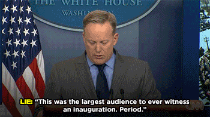
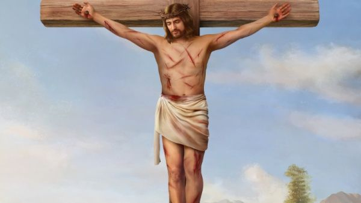
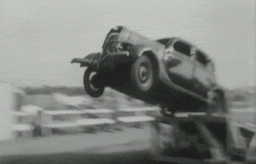

## But it's not Tuesday!

Stuff has been happening in the world of The Bachelor this week, which I thought I should comment on. 

Apparently it had come out a while ago that Rachael Kirkconnell from this season had a bunch of photos of her at a college antebellum "Celebrate the South" party. And someone who went to high school or college with her had commented that Rachael had made fun of her specifically for dating someone black.

Cut to earlier this week, and Chris Harrison decides to do an interview with another Rachel (without the 'a' this time), Rachel Lindsay. Some DuckDuckGo searching, and I discover that this Rachel was the first black woman on The Bachelorette (season 13), and is now a host on ExtraTV.

I've heard it did not go well. I'll be watching [the video on the extratv channel](https://www.youtube.com/watch?v=9hmY1gSAuRk).

_Just like regular episodes, I'll write this blog post while watching "live" (a.k.a. streaming on Youtube) - so it's my immediate reaction. Any subsequent notes or edits I'll highlight._

## What are your thoughts...?

Straight in with the "I don't have any idea, I don't know" deflection.

He's angry at the world being judge, jury and executioner about pictures of Rachael celebrating the Confederacy.

He's very peeved.

Chris says "it's a sorority party five years ago", Rachel Lindsay points out that it's specifically an "Old South Antebellum Party" from three years ago. 

> "It's not a good look"

Chris says "well, is it not a good look in 2021, or is it not a good look in 2018?". He reiterates that point when Rachel says it's still not a good look.

Is Chris a Trumpy person? Where he thinks that racism was still cool in 2018, but not now we're woke in 2021? Did he mean 1918? 1818?

**FIFTY MILLION PEOPLE** went to this kind of party in 2018, he claims. This seems a stretch.

> It's just a type of party. 

I mean, I guess the KKK is just a type of group of men in white clothing...

Rachael, in her innocence, can't possibly be expected to realize that the South has a racist history, or any details about that. I mean...I know there are problems in the US education system, but come on.

## She hasn't spoken...

Rachel says that it's frustrating that Rachael hasn't spoken out in response, when she's perfectly able to.

Chris says she can't answer everything. 

> Someone said "This person is a registered Republican and therefore they are a xxxx

Chris is so angry about this comment. I'm assuming "xxxx" is "racist". And he gets irate at the idea that "if someone voted for this person this means they're a that".

I'll go out on a limb and think that he's projecting a little. He is presumably most angry at the implication;

"Because Chris Harrison voted for Trump, he is a racist."

This seems a perfectly reasonably conclusion.

Has he said "cancel culture" yet? Are we hiding from antifa, yet?

## Two wrongs!

Other people have made mistakes. Chris "isn't the woke police" (no shit).

San Francisco is erasing Lincoln, Washington? Oh...we're going on the whole GQP talking point where they clutch their pearls about statues.

Chris, gentleman that he is, will wait for Rachael to speak out and will listen with care. But we shouldn't rush her...

_EDIT: Rachael has [since released a statement](https://www.usmagazine.com/celebrity-news/news/bachelors-rachael-kirkconnell-breaks-silence-on-racism-allegations/), where she does take responsibility pretty clearly, and acknowledges the racism in what she did. So good on her for that, for sure. Though a LOT of other stuff has come out about posing with Confederate flags, and other photos, etc, soooo..._

> Rachel - "It's been six weeks"

He's so angry at the idea that there is any request or demand or expectation that Rachael respond to accusations of racism.

## Chris gets trolled, too

Rachael doesn't even know what it's like, it's not a hard life like Chris has, getting accused of elitism or conservatism. He's such a martyr. 

Nobody reasonable is on social media, according to Chris. And therefore nobody on social media has the right to criticize "problematic" contestants.

## She's "dating" a black man

Chris thinks this is super interesting. That Rachael is on The Bachelor and "dating" Matt is somehow proof of her non-racism.

Let's be very clear - she is not "falling in love with Matt". She is using a TV show to potentially get onto another TV show (The Bachelorette), or raise her profile as a way of becoming rich, famous, or whatever. Like basically all the other contestants.

Rachel wants to know what Matt thinks.

My guess is that he'll exhale, and look blank. And come up with a bland platitude.

## Whataboutery

He compares Rachael going to this party three years ago with her being attacked for something she did in grade school.

"I don't know, you tell me" is Chris' go to response. 

Chris wasn't woke in 1970, but I don't think he's moved on much now. He's just "aw shucks" confused by all this wokeness and these ever changing standards about whether it's ok for he and others to be racist.

## "There is no high ground"

I think the not-racists have a higher ground than the racists.

## Will the show address it?

> It's first on Rachael

Chris chuckles at the idea that The Bachelor would choose to deal with racism (or bullying, or whatever). God forbid they should take any responsibility for any behavior on their show, however toxic.

_Does he also spoil The Bachelor, by saying that Rachael won't be on the post-show chat with all the contestants. So presumably she's in the final three?_

## Further reading / viewing

- [Higher Learning with Van Lathan, talking with Rachel Lindsay about the interview](https://www.youtube.com/watch?v=ln36XeP7qaQ)
- [Statement from Season 25 contestants (ET)](https://www.etonline.com/bachelor-season-25-contestants-unite-to-denounce-defense-of-racism-after-chris-harrison-interview)
- [Chris Harrison's "apology" the day after the interview (People)](https://people.com/tv/chris-harrison-apologizes-perpetuates-racism-addressing-bachelor-contestant-rachael-kirkconnell-controversy/)

