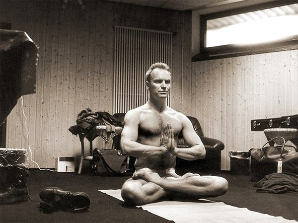
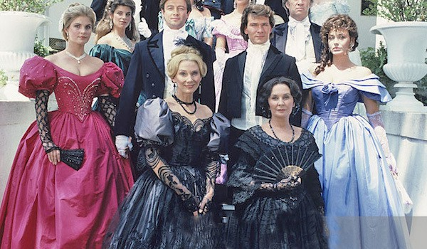
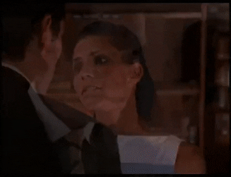
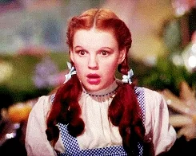

_NB: This week's watch and write up was delayed because of the Austin polar conditions. We're fine, lucky to have had power, many people aren't so fortunate._

Here are some resources to donate to help the most vulnerable at this difficult time.

- [Austin Area Urban League](https://aaul.org/)
- [Lifeworks Austin](https://www.lifeworksaustin.org/)
- [Powered by the People Welfare Check Phone Banks (sign ups on this calendar page)](https://events.poweredxpeople.org/)
- [Boss Babes' 'How to support Texans' Twitter thread](https://twitter.com/bossbabesatx/status/1362203708579192833)

Also, go and give money to [Texas Democrats](https://www.texasdemocrats.org/), so that we don't have to put up with these shitty, hateful, awful, #QOP politicians any more.

Anyway...**on with the show**...

_I'll write my blog posts while watching "live" (a.k.a. on ABC or Roku the day after broadcast) - so it's my immediate reaction. Any subsequent notes or edits I'll highlight._

## Prelude / preview

Everyone hates Hannah. They're mean.

Scenes from when Rachael and Chris Harrison didn't realize everyone knew they were racist.

## Who is that?

> What is going on?

Pieper is legit pissed.

Hannah Brown, who I don't know but assume is on another season, supposedly told Heather that she needed to be with Matt, and then Heather just randomly came to Nemacolin "because she had to try".

I mean...come on. As fake reality manufactured plot points go, it's a doozy.

Hannah is supposedly Matt's best friend. And also Heather's best friend. And has **never** before mentioned that these two would make a good couple. Until six weeks into the fucking season?

## Go away, Heather

> What are you doing here?

Jessenia points out that Heather is fucking late.

> So you missed that one, so you thought you'd try this one?

Jessenia is pretty blunt, and rightfully so. And all of the women are just straight up "go fuck yourself" to Heather. 

> Like, bitch, what are you doing?

Indeed, Kit, indeed.

Heather exits stage left, teary.

Confederacy Rachael points out, as the others have, that six weeks in is pretty late to shake things up. And she's right, it is super dumb. She seems to imply that, even if she were _also_ to get a rose, that if Matt chose for Heather to stay then he wasn't the man she thought he was, and she'd leave the competition.

Bachelor contestant strike would be fascinating.

Anyway, seems like all of the existing contestants are going to fight quite hard to push Heather out of the running to pair up with one of the most boring men in existence.

### Bullying?

I'm not sure whether the women's blunt reaction to Heather was bullying. I've talked about the bullying earlier in the season. This...I dunno. The entitlement from Heather (via the producers, of course) is strong enough that I think it likely would elicit this kind of reaction, and that reaction might be reasonable in its aggressive bluntness.

## Are the woke police here?

Chris Harrison, before the "I'm a racist who's gonna 'step back' from the contest" reveal...such an innocent time for him...comes to give some moral support to Matt.

## Matt's been processing

He's impressed that Heather has "been bold" (or, at least, had tickets bought for her by the show producers).

But...Matt actually does the right thing. He says no! He's actually respectful of the women who have already put the time in.

And so ends a truly pointless, manufactured, piece of "reality". But at least Heather got two weeks to chill in quarantine at Nemacolin.

NB: I will put a lot of money on the fact that at no point did Heather rent her own fucking minivan to come.

There is **a lot** of dramatic music put toward the farewell of two people who literally met twenty minutes ago.

Heather doesn't even get a limo, she has to drive herself.

Anyway, was that whole thing some weird flex by The Bachelor to make Heather feel like shit? Did she piss off Chris at some point on her season?

> My heart's here

Matt gets some big props from all the women. And he even remembers that he needs to finish his conversation with Pieper.

It's a good episode for Matt so far!

## Straight to the rose ceremony

Abigail is worried. My bet is that she won't get a rose this time round.

Matt...well...it's a rose ceremony, and it's been stressful, so he does a big exhale before he even gets into the room!

Only six roses left now!

Abigail and Serena RBF would be my bets to not get a rose.

> I really do see my wife in this group

- Bri, despite being a little bit of a backseat the last episode or two
- Confederacy Rachael
- Peppy Serena
- Kit, who looks especially chic but also not about 14 like she usually does
- Jessenia

> It's the final rose tonight. HIDE IT FROM THE WOKE POLICE!

- Abigail. Oh, surprise.

I'm genuinely shocked that Chelsea didn't get a rose. She's fucking way out of his league, to be fair. She catwalk walks away.

Serena RBF smiles more in saying goodbye than she has all season. But we still have her boots from a couple of episodes ago. She seems pretty chill about going, though she tries to poke herself in the eye to suggest some tears.

How are hometowns going to work in a time of COVID?

*Commercial (looks like some people are getting surprise sendings-home)*

## Recharged

Jessenia and Abigail are bonding in yoga pants, feeling chill.

Cancel Culture Chris Harrison is here to talk hometowns. Everyone will "get time". He needs to tuck his shitty shirt in.

Pieper reads out the first date, and Peppy Serena gets the nod ahead of Jessenia and Abigail...who haven't had one on ones. Also, Pieper looks super athletic in her athleisure.

## Notes from Katie

Peppy Serena has been learning from Katie's attack hugs. Remember, Serena, that didn't help Katie out last episode!

### Tantric yoga!

That's this...

Serena is very bendy. Matt is "not a yogi", he says. Their yoga instructor has a weird baggy pantsuit thing going. And Serena feels super awkward about all the sexiness - to the point of pulling away from a kiss.

After the date, Matt talks about how he hasn't stared so deeply into someone's eyes like that for so long. But we all know...

## Deciding factors...

Rachael doesn't know what criteria Matt is using to choose how he filters everyone down to homecomings.

Probably not "Celebrate the South" party-going, at least.

The group date comes in, and Abigail's on it, which means a big smile for Jessenia as she gets the last solo.

It is a little odd that Abigail has gone so deep into the competition without a solo date, right?

### Back on the date

Matt is delighted to have found a woman who takes the radical step of saying that she isn't a huge fan of tantric yoga. She's "being real".

### Abigail's dilemma

She's confused. Kit's advice is a little "let me help" and a little secret implication of "maybe you should just quit, he doesn't seem that into you".

### Back on the date (again)

Serena wants Matt to meet her family.

Matt, and his fisherman sweater, loves getting that kind of validation, and so he gives Serena the rose.

So, sorry Serena's family, I'm afraid you'll have a couple of days of having to get bored by Matt's bland platitudes.

They go ice-skating. They make it look really boring. They're exceptionally dull as a couple.

*Commercial (and some "surprise" to come)*

## Peloton!

Matt's working hard to stay in shape.

The others are getting ready for group date. Kit looks fly. So does Bri.

The kerning on "The Lodge" at Nemacolin makes me feel very uncomfortable.

Confederacy Rachael's outfit is awful. Bri and Kit aren't wearing the cool outfits that they were wearing in the pre-date preview montage. 

### Workin' nine to...oh...

Bri still looks lovely. And she has a big bombshell...she's quit her job...her "dream" job...to stay on the show with him.

**WTF Bri?!**

I dunno, that's so stupid. 

Matt, however, is super excited about the prospect of a woman who'll give up her own dreams and independence in order to make him happy.

Bri's (snakeskin? crocodile?) boots, however, are **amazing**. Even Serena RBF would be jealous.

## The Michelle connection

She's still the only one he closes his eyes to make out with.

## Abigail's reflections

Matt's got hands on her leg before she's sat down, as is his usual wont.

She's got a whole dream thing about what she wants, and how she can put Matt into it. But she fairly asks whether she should invest now, and if he feels even partly the same.

Matt doesn't feel the same way. He doesn't want to lead her on, after he basically forgot about her from the first episode and put her on a shelf while he explored some other options.

I guess the producers didn't want to eliminate the deaf woman too early, though.

> I'm the person who makes men realize what they want next...

Ooof. Poor Abigail! You're very lovely, and hopefully should end up with someone more interesting than Matt.

## Make or break time for Confederacy Rachael

Oh, actually, her dress looks way nicer when she stands up.

Chris has already spoiled that she's going to the final three in his [car crash interview with Rachel Lindsay](https://www.youtube.com/watch?v=9hmY1gSAuRk).

Rachael (21?) says she's been "searching for her whole life" for this.

Matt provides some cookie cutter compliments that he could apply to anyone.

## Are we on the same page?

It's intense for Kit. She can only make it through by serving great looks.

She wants someone to cheerlead her, and let her finish school and get her career up and running, and wait for her dreams to be fulfilled before she's prepared to have kids (at the hoary old age of "25 or 26").

This is **great** from Kit, honestly. She is absolutely clear about her expectations, and they don't involve compromising her desires to satisfy a man. And that's something Matt claims he is cool with.

...and then they share the most awkward kiss we've ever seen since the last time they pretended to make out. Oh, god, it's so awful.

*Commercial*

## The last three steps

Confederacy Rachael lays out what's left to come

1. Hometowns and meeting families
2. Let Matt test drive you for sex in a fantasy suite
3. An engagement that won't last six months

But Confederacy Rachael gets the rose. Which is a bit of a surprise, honestly, because their chat was one of the more boring.

Although, so is Matt.

It seems clear that Chris Harrison's defense of Rachael in his interview was so adamant because she's gonna be, if not the winner, one of the last two women on the show.

## Kit's surprise

Her "to camera" suggests she's gonna leave. And she comes to visit Matt before the rest of his night.

She is so tiny! And so chic!

Yeah, she's saying goodbye. She's not sure of him. And nor should she be.

Don't be upset Kit! You're 21. Your [mother has a fashion label](https://cynthiarowley.com/). You have [your own fashion label](https://kitkeenan.com/). You should be going out in New York, hitting the fashion parties, taking cocaine, looking super stylish, getting mistaken for Anya Taylor Joy.

Quite self aware for a 21-year old. And politeness personified in getting out when she (clearly, in the background) realizes that she has zero chemistry with Matt, and wouldn't want him traipsing around behind her being all bland for the rest of his life.

## Jessenia finally gets a one-on-one

Courageously matching blacks and grays in her coat with a brown sweater.

My wife comments; "she looks like a Christian sorority girl who does anal so she can pretend she's still a virgin"...

They're gonna be doing some...drifting...

Or, really, looks like they're going to be doing some crashing. Jessenia's role is to...what...get driven.

Don't sit on a car hood wearing white pants, you're gonna get dust marks everywhere.

For an "action" date that was...really boring.

### Christmas lights!

At least there isn't any food on the plates, so they're not pretending they eat on their dates. I like Matt's olive hoodie.

Also, don't "cheers" with just water, I believe it's bad luck.

We're all serious talking about what a hometown would look like, and how much Jessenia's family want for her to find someone.

Matt, seriously, looks so fucking uninterested. Even more blank than usual.

Jessenia is going to break the streak of "tell Matt you're falling in love with him, get a rose". Her face is absolutely expressionless when he tells her.

She does walk out wearing the nicest dress thaat she's worn all season.

## Five left...

Bri has gone 90s this episode, from her previous cool 80s looks. Her little black dress is way better than her white dress from the first rose ceremony.

Prediction - Pieper will be eliminated.

The exhale, as always...

- Bri, in her 90s club dress

And, ffs Chris, there were only two roses to start with, and you **STILL** have to pop up to tell us it's the final one.

- Michelle, who still seems the only one he has real chemistry with

Pieper is wearing by far the best dress of the evening, and she is _not there_ for a comforting goodbye with Matt. She's really upset because she "followed her feelings and emotions"

## Next week

Why aren't all the family's opinions "what the ever living fuck are you doing on this show?"

And jumping out a plane, which is terrifying to me. A lot of...um...very literal "leap of faith" activities.

## Epilogue

Wow, Peppy Serena really fucking cracked Michelle's back. And then Michelle wants to get properly pumped for her close-up by doing push-ups (in heels, too).

The epilogue seems like the most natural socializing the group's done in the entire show to date.

