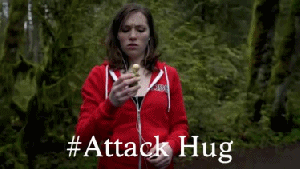
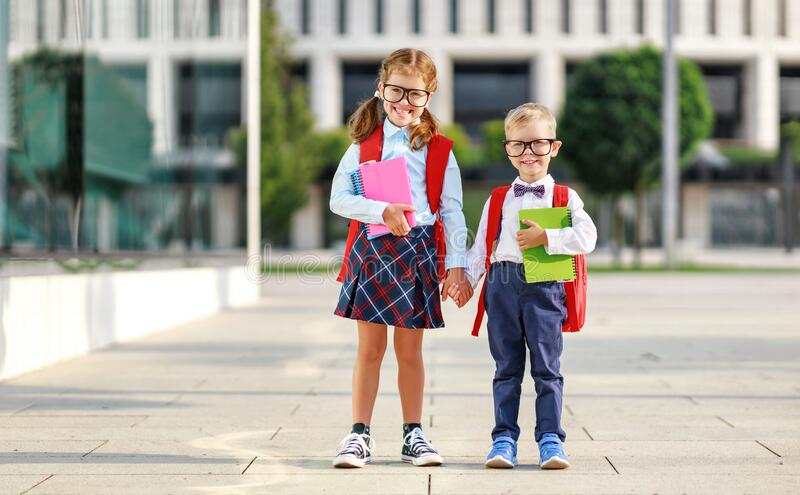
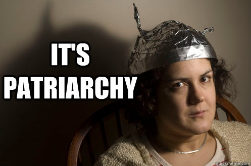
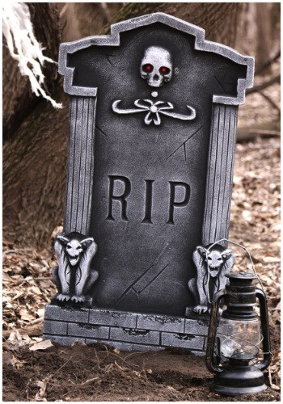
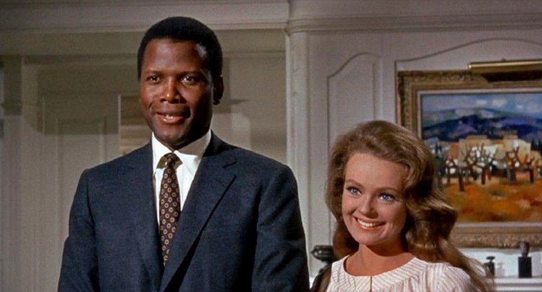
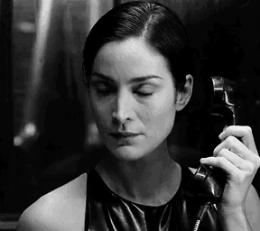
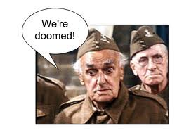
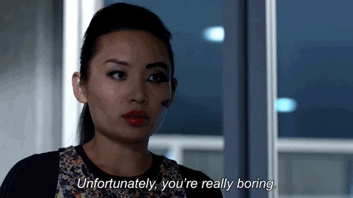
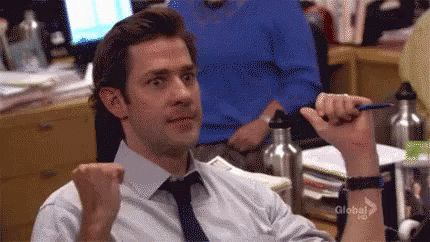

_I'll write my blog posts while watching "live" (a.k.a. on ABC or Roku the day after broadcast) - so it's my immediate reaction. Any subsequent notes or edits I'll highlight._

## Prelude / preview

**HERE'S MY FAMILY!!**

A bunch of awkward greetings with parents.

Tears. A little bit of familial honesty.

Does Confederacy Rachael die in a tragic parachute accident?

## Sit ups!

Matt's doing a lot of oblique work to prepare for meeting families.

He shouldn't be wearing skinny tapered jeans that lengthen his leg when he's so tall already.

Beware the Woke Police Chris comes to explain "hometowns". The concept of this honestly creeps me the fuck out.

## The increasingly inaccurately named "hometown"

They don't get to travel to all their home states. Instead, their families have suffered through their own quarantine to further suffer through the bland platitudes of the guy who's got a 75% chance of boning their daughter in next week's episode, but only a 25% chance of proposing to her in and having a six-month doomed engagement.

Serena - mum, dad, and her sister

Confederacy Rachel - Confederacy mum, Confederacy dad, Confederacy sister

Michelle - mum and dad

Bri - best friend Bri (?), mum, and "baby" sister

> Cancel Culture Chris: It means the world to Matt.

## Michelle gets to go first

Everyone with the fucking attack hugs now.

They match in a kind of freaky way. Michelle looks more sober in preparation to meet her family.

They hold hands while bicycling. And they talk about how they would cycle with children, so that's...sweet, I guess.

Do the women get to plan the hometown dates? I guess that makes sense, as it'd usually actually be in their hometown.

### Poor kids

Michelle's elementary students are forced into a Zoom call about a topic which they can't really possibly understand. But they have some producer-supplied questions that they can pretend are theirs.

Matt refuses to commit to a rose, even to a little girl.

Matt then spends some time lying to the kids about whether he's kissed Michelle, how many girlfriends he's got.

_NB: If you're embarrased to explain the relationship situations The Bachelor puts you in, to schoolchildrem, maybe reconsider those relationship situations._

> We're in the process of figuring that out, and I can't give you a definitive answer.

...is **not** an answer to give to an under-10. Bland platitudes should be age appropriate. That's an NFL player deflecting a question about his contract renewal.

Elise reads an inspirational note. Matt loves the question and has some bullshit answer.

The kids are all well trained and nobody gives him the more accurate "zero or one thumbs up".

### Bland platitudes

It's funny when Matt gets sincere and tries to ask all his scripted questions to show how "serious" he supposedly is.

Michelle's parents were **completely fucking rightly** hesitant about Michelle going through this process.

They make out, I can't see whether he closes his eyes. THey kind of blend on screen because their clothes are the same color.

*Commercial*

### Nemacolin does Airbnb

Michelle's mom definitely looks like she's from Minnesota.

Oh, are we into the need for patriarchal approval part already? Ephraim seems like a sweet guy.

Michelle is looking for a guy who builds gardens for kids to grow food. It's a weird answer to "why this guy?".

Sounds like Michelle has had a super shitty relationship in the past. Which, honestly, makes me even more shocked that the parents would even countenance something like The Bachelor.

Oh, now Matt has to pass patriarchal approval (dad gets to quiz, mum doesn't). Matt might even move to Minnesota!

Mum and Michelle meanwhile are having the "girls'" chat. Her mum's question...

> Do you see dad at all in him?

That's fucking weird.

Mum and dad both express a grudging acceptance that they'd love Matt. I mean, obviously as an adult then Michelle should be making her own decision, and her parents should support it, but you'd think there might be one or two more pointed questions.

There's an awkward basketball scene while Michelle talks about having Matt in the family. 

Matt insightfully notices that Michelle's parents have influenced the person that Michelle is.

Remember, Michelle, telling Matt you're falling in love with him is no longer a guaranteed rose.

*Commercial*

## Confederacy Rachael's day!

Wtf is she driving?

Matt's going for the tech vest look. Rachael the dire tie dye pink top look.

She...blindfolds Matt and takes him on a joy ride, and leads him stumbling to a...plane. Her date is to jump out of a plane!

> Matt: What could possibly go wrong?

> Instructor: 12,000 ft, 120 miles an hour.

The trainee instructor is super happy he's paired with Rachael. I think he maybe surreptitiously stroked her hair.

The romantic date is to jump out of a plane *while literally strapped to another man*.

Matt is so excited, he honestly is like a small child. It's either the parachuting, or being wedged between the instructor's legs. He spends **a lot** of time snuggling into the instructor on the ground, too.

Trainee instructor got distracted by Rachael's hair, and they crash and she dies.

### OK, she doesn't die

Even Matt's concerns about Rachael's near death experience are pretty bland.

> I was really, like, worried. Like, damn...

Confederacy Rachael is smitten by his concern.

*Commercial*

### Here's my boyfriend...

A little preview where Rachael's dad Darrell is saying that he thinks it's all too fast.

Rachael is already on about Matt asking her father for his blessing. That's really still a thing.

Mum and daughter go and talk, and Matt and Darrell stare awkwardly. Men and women obviously shouldn't be talking about things together. 

Rachael implies that Matt is perfect, but that she isn't. Her mum wants to know what's wrong with him. She's still smitten by his reaction to her fall.

His reaction was the type of concern any basically decent human being would show. It's not something to look at as proof of love!

### Doubtful Darrell

Darrell is, obviously, doubtful that this is something real so quickly. And while Matt is seeing a bunch of other people.

Matt does his best to try and justify the appalling environment of The Bachelor in general.

To camera, Darrell rightfully points out that this is all fucking bullshit. And then points that out to his daughter, who is having none of it.

To be fair to Darrell, he says he'll be supportive of his daughter's decisions despite his doubts.

Rachael's sister, Trinity, appears for a nanosecond. She has a non-speaking role.

### But I want to be given away as a possession

Rachael is really disappointed that one man didn't ask another man for a blessing to choose the path of her life, without the need to ask her.

*Commercial*

## Single parent children date

Bri's here. Matt needs to push past his "comfort level".

There's another attack hug. The trend is strong.

Bri looks rad. Matt doesn't look super into her, though.

She's gonna take him off-roading and show him how it's actually done. And, no lie, she does seem like she knows what she's doing. Gotta love a woman looking that put together and smashing a muddy jeep through an off-road course.

### I have a job

Matt's always had a job. Stable income is probably his most attractive feature.

They bond over being brought up in single parent households. Which, honestly, seems like a legitimate thing to bond over. I can't really speak to it.

**BUT WITHOUT A FATHER, WHICH MALE AUTHORITY FIGURE CAN MATT ASK FOR A BLESSING FROM?**

Remember, Bri...while super 80s fly in earlier episodes, **gave up her job to stay on The Bachelor**! 

Oh, but wait...Matt actually **closes his fucking eyes** to make out. Has he done that with anyone except Michelle before?

*Commercial*

### A stupidly large stuffed rabbit

Why, Matt, why? Who is that gift for? Oh...when Bri talked about a "baby" sister, she really meant a fucking baby. Who they still brought out during COVID?

Bri has a friend called Bri, who looks like her, and dresses like her, but is just a bit taller.

Bri's mom is gonna drag Matt away. And she's not super keen on the whole Bachelor thing. And she has zero time for Matt's obfuscation.

But she's amazing with Bri in her support and trust for her daughter's feelings. That if it doesn't work out, she'll be there to help heal, but that Bri should be vulnerable if she really believes (...in this **absolute fantasy**, but still).

Bri really really struggles in saying that she's falling in love with Matt. Like she has to choke it out.

> Matt: Thank you for sharing that with me.

Oh, no...

Bri has rad boots again. Not as amazing as last week, but fierce.

*Commercial*

## Peppy Serena time

Attack hugs for the third time. Confederacy Rachael is the only person who didn't fall into that trap.

Matt is looking a little better in his royal blue bomber jacket.

### Blame Canada!

Oh, we're really going for this. Like *really* going for this. In a kinda stereotypical, but also a little charming way.

**I really want poutine**

> Do you like it?

What the fuck is not to like about poutine? It's a near perfect dish.

Is this the first time anyone on a date on The Bachelor has actually eaten food?

Then they briefly play ice hockey.

But, unfortunately, when it comes to the kiss...

**DEAD EYES!** **DEAD EYES!** **DEAD EYES!**

### Some fine leather pants

Peppy Serena's brown leather jeans are great.

This is the most welcoming famiy, though, and the most immediately natural social dynamic.

And...are we stepping away from the patriarchy? Serena's mum takes Matt away.

Fuuuuuck, Matt. Can you ever come up with an actually interesting or insightful thing to say about one of the women you're spending time with?

> She challenges me. I come away from conversations thinking of her.

Serena's sister is right into it;

> Do you love him?

Serena's answer is cause for concern...

> On paper, and in my head, he's perfect

Which usually has an unspoken "but". Her sister doesn't leave the "but" unspoken, though - she's right there, and says that she thinks Serena is talking herself into things. 

Go, Talia.

I think Serena will take herself out of the competition tonight.

...her mum is more positive, and thinks that maybe Serena is just screwed up from her **last** relationship. 

Talia has great, subtle shade, for Matt as she says goodbye;

> Good luck. With everything. _(in your life which won't be with my sister)_

Oh, and second kiss in a row...

**DEAD EYES!** **DEAD EYES!** **DEAD EYES!**

Serena says in voiceover that she's "falling for Matt", but honestly it sounds like she's trying to talk herself into it...just like her sister said.

So...are we down to Michelle and Confederacy Rachael, as real contenders, or is Bri a late runner?

## Deep thought

Matt is "processing".

> Racist Chris: How's it goin', bud?

Chris says that he thinks Matt adores Serena. But Matt is concerned about Serena's commitment. Chris suggests that Matt makes some grand gesture or "finds out before he hands out another rose".

Is Matt seriously getting irritated about the fact that Serena has some doubts? Fuck him, who wouldn't have doubts. Well, really, who wouldn't run fucking screaming from both The Bachelor as an environment, and a bachelor with the emotional and sexual magnetism of a piece of wood.

### Deeper conversations

Matt wants to confess that he...likes her and spending time with her...which is basically it. He actually really goes for it, though, and kinda tells her that he likes her the most out of all the women.

Serena...far from peppy right now...lets out a big sigh. There's some nice words about how great Matt is. But she's dumping him.

> I don't think that you're my person.

Matt seems a little blindsided. I think he thought he was just gonna stay in control. But he pulls it back to say that he wants her to be happy and stuff.

Good on you, Serena. Would've been easy to just see things out. But instead she says goodbye. Matt is very emotional, and now he's worried about the other three.

## The easiest rose ceremony ever

A quick chat with Chris, who digs in the knife about everyone else's commitment to him.

Matt says that accepting a rose means accepting an engagement. Which is true. And they should think on that. Which is actually a good thing to say. 

It'll be a failed engagement, but still an engagement.

- Michelle "accepts without hesitation"
- Confederacy Rachael "thank you"
- Bri...whose dress is wild, and hot as hell. She says yes, and gets a real evil look from Michelle when she walks back.

Bri wonders why she was third to get the rose, does that mean she's third choice (I think probably yes - even though it could just as easily have been the order of the dates).

## Next week!

Oh, the women tell all.

Victoria looks dramatic.

Matt grew a beard!

## And in two weeks...

FUCK TIME!

And maybe he gets dumped by Confederacy Rachael. And maybe Matt gives up.

## Epilogue

Matt does some childish bike riding, and falls off. A passer by scuttles out of shot as quickly as possible.