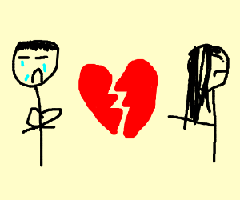

_I'll write my blog posts while watching "live" (a.k.a. on ABC or Roku the day after broadcast) - so it's my immediate reaction. Any subsequent notes or edits I'll highlight._

## Prelude / preview

_The women tell all_

Ah, it's the episode where all the women come back and "you won't believe what they have to say".

Matt is cosplaying as Tim Howard.

Peppy Serena...don't doubt your decision to dump him!

## "Previously recorded before Chris Harrison showed he was super racist"

Heartbreak, drama, rumors!

Chelsea in a fine blond do and snakeskin print top, and fabulous boots. Not sure about Kit's sleeveless pink tailored top. _EDIT: Have since discovered that Kit is wearing vintage 80s Chanel...but still not sure it works for her_

Khaylah's earrings are intense.

## Matt pumping iron

Recaps and replays. Matt doing Rocky montages. 

Brief highlights of people being mean.

I forgot about Sarah Symmetrical Face.

> Sarah doesn't need Matt, Sarah needs a Xanax.

I forgot how lovely, and kind, Victoria was.

## The new girls get bullied

Yeah, I remember this was not nice. It was pretty shitty on everyone's part, but I'm sure the producers loved it.

MJ in faux military fashion lost her war with 70s Charlie's Angels lookin' Jessenia.

### MJ and Jessenia...FIGHT!

 defeats 

Jessenia going with a less fierce pantsuit tonight, in bright pink. She kinda pulls back from how pissed she was with MJ. MJ is wearing a nice nude dress, and doubles down. 

Mari jumps in to say how "not-fake" that MJ is. 

### Shitty for the new girls

Uncomfortable. Awkward. Stolen tiaras.

And Mari, having jumped in to take a bullet for MJ, then jumps in to stab Victoria for being mean.

Ryan is upset that she brings joy and emotion as a dancer, and Victoria didn't respect that. Victoria straight in with the gaslighting that Ryan is too sensitive and emotionally angry, and that she got death threats. Victoria is winning on sequins, though.

Fair play to Kit and Chelsea, who call out Victoria that saying Ryan is too sensitive is gaslighting.

*Commercial*

## Apologies please!

Replay of Victoria and Katie talking about how much they don't deserve apologies and how Katie likes dildos.

Chris says all these women are already really emotional.

Victoria straight up apologizes to Katie, who accepts it, and both of them talk about how tough it was. 

Chelsea is pretty pissed with Katie saying "it's all karma", though...and she's right, nobody deserves online abuse for saying something on a fucking stupid reality show. 

Katie says that Chelsea is "blind", and that it was all mean girls. 

Oh, and then Chelsea punches back and claims that all the toxicity came from Katie. And a few more pile on, Mari, Pieper...apparently all upset that Katie even raised the fact that bullying was happening.

Serena RBF says it was all a ploy from Katie, Jessenia leaps to her defence!

NB: Changing your mind about something is not "being fake".

## Let's remember that sex work shaming

Brittany is called up to talk to Woke Police Chris...after...

*Commercial*

> One of the craziest rumors I've heard in the history of the show. A devastating rumor, let alone on TV.

Two things, Chris.

First...it's only devastating because of the disgraceful stigmatization of sex workers in general.

Second...if it was that devastating, then you didn't have to fucking broadcast it.

Oh...and a third point...**if you're on The Bachelor then you're involved in sex work**. Which is fine, except entirely hypocritical from everyone criticizing someone else for a rumor about sex work.

### How shitty is this for Brittany?

> There is nothing wrong with that industry

I'm glad that Brittany said that, while also talking about the difficulties she's had after it was broadcast. Though she should also be furious with The Bachelor (and, arguably, should be suing them...surely?)

What does Anna have to say? That she has no excuse, and that she feels bad.

> It just sucks that I did that to someone else.

At least, I suppose, she said that in apology, and owned it. Brittany isn't having it, though, because it's the first time Anna's given her an apology.

Mari wants to know a motive. Anna blames her own insecurities. But then she says "but I was getting messages from people who knew your ex-boyfriends and stuff", so fuck you, Anna.

**Doesn't Brittany have some kind of case to make against The Bachelor and ABC?**

Brittany is fairly noble about the whole thing, and also very sex work positive at the end of her interview. Big thumbs up to her. 

And still shame on The Bachelor franchise as a whole for that episode of television.

*Commercial*

## Things that got cut

A date they didn't air, called "what's in the box"...

Ewww. They made them do this *and* they then didn't show it? 

They cut out whole dates from the series but kept in a bunch of rumors about someone being bullied over a rumor about being a sex worker?! That's ridiculous.

And it wasn't the only date they just completely cut? They had one with some fratboi douche barking orders about fucking pancakes. 

Fucking fair play, Victoria. I'd have cheated through that, that was disgusting.

And a **third** date they cut entirely but kept the bullying in instead...

Ninja Matt is not ninja...

Kit is...not so much on the wilderness.

### Salmonella for everyone!

Jesus, a fourth piece of a date that they didn't even show people.

Kit smartly cheated. Katie barfed.

MJ has a fear of birds. She just needs to remember that [birds aren't real](http://www.birdsarentreal.com).

*Commercial*

## Katie time

Some outtake about Katie skateboarding in a sequined mini dress.

Chris can't bring himself to say the word "dildo".

My favorite thing about Katie was that she was genuinely sex positive and just open that pleasure is totally fine.

Also, the lead of this season's attack hug trend.

I forgot how many times Katie and Matt made out; the highlights make it look like they were way closer than was really the case in the season. She was never in the running.

Katie tears up at the memory.

> The one thing that kept me going was Matt, and our connection. I really thought he was going to meet my family.

Just be thankful your family didn't have to get bored by that, Katie!

Katie worries that she's still single at the ancient age of 30!!! On the other hand, Matt was *the first* person she's ever been herself with. So I wouldn't sweat it, too much, Katie. 

*Commercial*

## Abigail time

How old is seventh grade? Matt says the first time he kissed someone he made them bleed. Now, he just makes your ears bleed from boredom at his personality.

First impression rose, she was sweet at the start, I remember.

She had very serious conversations to have with a man wearing such a purple sweater.

And she also got the *shittiest* dumping from Matt, which was "we had such a good initial connection that I forgot about you while I dated other people, and now I like them more".

So, lucky escape. She did seem really nice.

We get a bunch of stuff about her positive impact on the deaf community. And has some interesting discussion about the "Deaf community" and being deaf (but not knowing sign language). I actually learned something.

- [National Association of the Deaf](https://www.nad.org/resources/)

*Commercial*

## Pieper takes a break from college volleyball

I'm sorry, she just looks like shes on a college volleyball team. I liked her, but she was very...collegiate. And absolutely far too young to be thinking about marriage, surely.

She definitely fell prey more than some other women to...

**DEAD EYES!** **DEAD EYES!** **DEAD EYES!**

...her reaction after she didn't get a rose flagged a few issues of self-confidence that it feels like she might want to work on.

She is a student and she's 23...yeah...live some life, first!

I really like her outfit tonight, she's got some 🔥 high waist harem pants.

And she shouldn't settle again, so good on her!

## Peppy Serena

Serena P has gotten more attractive as the show has gone on, and looks *amazing* tonight.

She was also smart enough to dump Matt, so she starts with brownie points.

I forgot how Matt toasted to "breaking the norm" during possibly the most boring date in the world (except for the donkey).

My wife wants to know if every contestant has got teeth whitening services in advance of this episode. Peppy Serena certainly looks like a movie star right now.

Matt still didn't close his eyes when he made out with her, though.

Thankfully, as we found out last week, Serena's family are sensible enough to notice that Matt is really fucking boring, and Serena can do much better and shouldn't rush into anything.

Yep, Serena...your family saw how "amazing" Matt was, and immediately advised you to not make that mistake.

Chris wants to prod a bit and suggest that Serena made the wrong call.

**YOU DIDN'T MAKE THE WRONG CALL, SERENA!**

And, thankfully, and to her credit, she knows that and seems comfortable having made that choice.

*Commercial*

_(The Bachelor episodes are really really long, aren't they?)_

## Introducing US soccer legend Tim Howard!

Oh, wait, it's Matt.

When is this filmed? It must be filmed after the actual season has wrapped filming, so he knows what the end result was, and he can't spoil it, right?

Matt is surprised by the drama on the show. But he won't get into any controversy. I'd far prefer it if he'd said "oh, that was a fucking lie from her, and I believed it"...

MJ looks like she'd happily claw Matt's face off. The series OG bitch face, Serena RBF, gives Matt props for how he dealt with things.

God, he's so awkward, isn't he? 

Has he oiled his beard for the show? It's glistening!

Victoria expresses some emotion about how she left. Actually, how she left and how blunt she was with Matt was one of her better moments.

Katie also wants to give Matt some platitudes about "how well he handled things". I suppose there is some irony in smothering Mr Bland Platitude with his own bland platitudes.

### At least they noticed he doesn't close his eyes!

It's sooooo creepy.

It's not fucking eye contact if the other person has their eyes closed!

**DEAD EYES!** **DEAD EYES!** **DEAD EYES!**

AND WE KNOW THAT HE CAN CLOSE HIS EYES. He's kissed with his eyes closed with Michelle, and with Bri.

So, what we're confirming, is that for all their nice words, all the women were creeped the fuck out by Matt.

## Someone say something mean

Fuck's sake, Abigail. He told you "you were so great, that I forgot about you". And you just want to say thank you?

Why is everyone just saying "thank you"? Someone say "fuck you".

## Blooper reel

Sheep run away from Matt and Peppy Serena. Meanwhile, a donkey poops.

Bri spits up her wine.

Bugs attack peppy Serena. And Chelsea. And Katie. And peppy Serena again. And then it flies into Chelsea's vagina!

Where did these women come from? Why is one of them dumb enough to think dragonflies are poisonous?

Brittany can't say words.

Matt fell over a chair.

People banged their heads a lot. 

Matt got hard for peppy Serena's ass. Ew.

No...Chris, you won't all soon be together again. At least, you won't...

## Next week!

Next week...it's fuck time!

Looks like Bri in particular is getting very much into the "fantasy" aspect of the suites.

Rachael seems to just be realizing the nature of the show means that Matt is test-fucking the other women, too.

Matt walks in the snow. Argues with his (estranged?) dad. His mom is dismissive of love.
 
Everyone cries.

## Epilogue

Literally. Literally. Literally. Literally.

And squirrels.