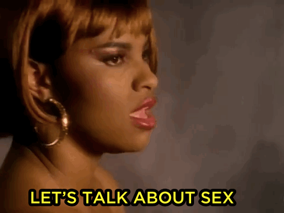
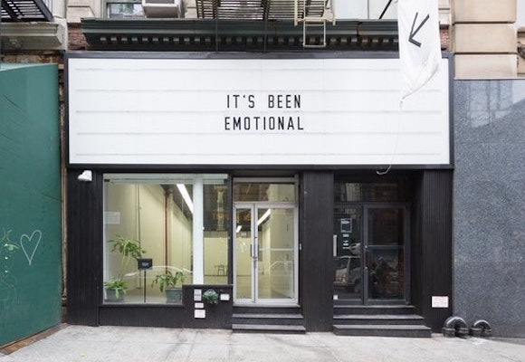
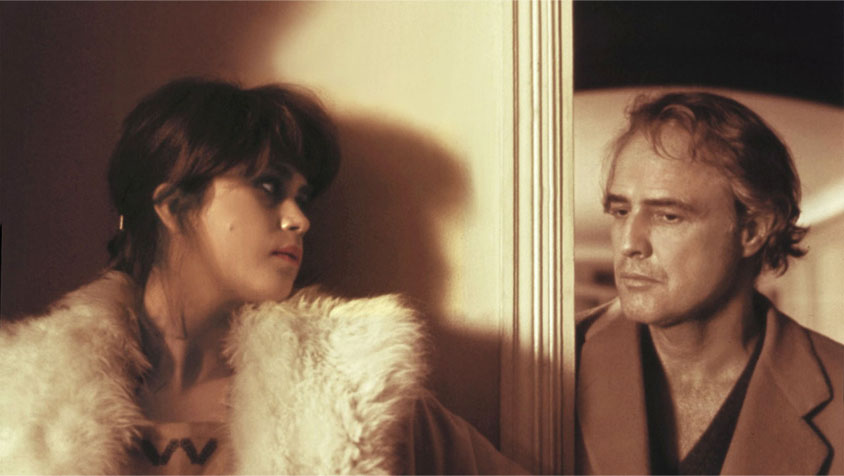
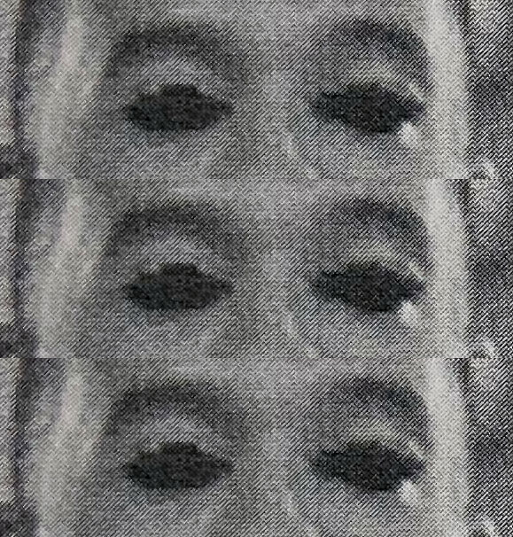
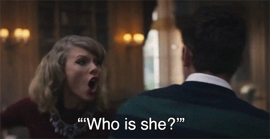
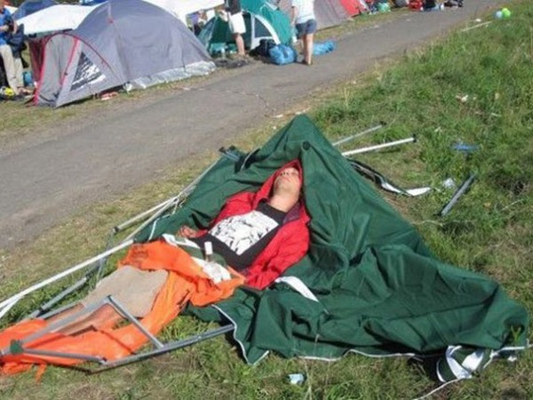
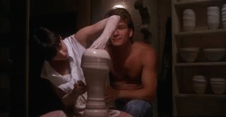
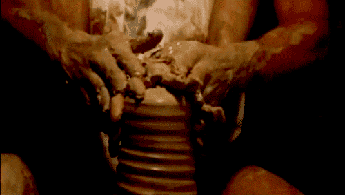
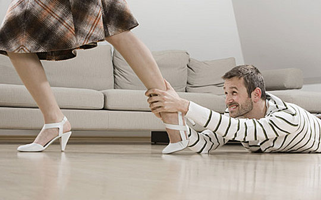

_I'll write my blog posts while watching "live" (a.k.a. on ABC or Roku the day after broadcast) - so it's my immediate reaction. Any subsequent notes or edits I'll highlight._

## Prelude / preview

Groping.

Having to say "be intimate" when you mean "have sex".

Confederacy Rachel goes insane.

## It's fuck time

This is the one where The Bachelor gets to test fuck the final three women.

## The women's deep feelings...

> Michelle: "I am ready to spend the rest of my life with Matt. And I'm ready to tell him that I'm ready"

> Bri: "It's exciting, because Matt is such an amazing, empathetic, person."

_REALLY, BRI?_

> Confederacy Rachael: "I'm so sure of him. I just feel with every sense of my being..."

And then they all chat about "hometown at Nemacolin" and that they can't imagine not being engaged to Matt.

## Hi, Chris!

Middling cardigan game.

> You'll have fantasy suite cards, to choose what you wanna do.

It's so funny that they've set up this situation which is literally "here is a chance for the two of you to fuck", and they absolutely can't address it verbally, nor mention the word sex.

## Michelle gets to go first

She's not kidding around.

> I hope that's the mindset he's in, because that's the mindset I'm in.

## We cut to Matt's thoughts...

The very first thing that Matt says, on the episode that's all about fucking, is...

> I'm conflicted, because one of the biggest problems I've had in past relationships is going deep...

**OH, COME ON!**

He claims it's about emotions, but I nearly spat my drink out.

Anyway, there's an ominous knock on the door, and Matt needs to have a conversation...implied a very weighty conversation...with his dad.

*Commercial*

### He gets his height from his mom...

So he needs to talk demons with his estranged dad (at least, the implication is that they're estranged).

It's...um...awkward. And it's pretty much "hey, dad, I'm gonna film me talking about how you were shitty".

It's a weird conversation. Don't get me wrong...it's legitimately an important and good conversation to have. I can't decide whether it's good to publicly portray the conversation, or sketchy to be voyeuristic about it.

Matt says his dad needs to know where he's at. But he also seems to completely fail to explain where he's at. Other than that he was (of course) upset that he had an absent father in his life.

Like, the encounter is important, but I don't really know what Matt is trying to achieve. That he looks at his relationship with his dad as a blocker for him making commitments...that's as much on him as on his dad, surely?

Anyway, I kinda think he wanted an apology and a promise to work on it. And he gets that. And it's fairly moving, and hopefully these two men will build on this in reality.

_Huuuuuuug._

NB: The kids that Matt's dad sees in future will, I am willing to place a wager, not be kids he has with any of the women on this show.

*Commercial*

## Can we get to the sex yet?

Nope. Raindrops, emotions, puddles, voiceovers.

Oh, but Matt's done with it now. 

Why would an overnight put to rest concerns about long term commitment?

Anyway, with the staggering lack of imagination that we've come to expect from Matt, he's got Michelle a spa day.

### Rustic

So there's furs, a roaring fire, some taxidermy, some oatmeal for the feet (eeew).

I quite like Michelle's bathing suit.

There's milk...

There's also butter...

It's fucking odd.

### Sofa chat

Bland platitudes ahoy!

Matt's sweater game tonight is lame.

Michelle has a moment of realism and points out that staying in love is hard, and needs work. It's even harder when you're not actually in love, and have just been thrown into an artificial environment with one of the dullest men on the planet.

...are they hiding Matt's face for makeout sessions now, because of the issue we all know about...

**DEAD EYES!** **DEAD EYES!** **DEAD EYES!**

### The night time date

Jesus, Matt, that leather collar thing on that jacket is seriously heinous.

It's all serious again, as he talks about the chat he had with his dad, and how he doesn't want to be like that in his future marriage.

Michelle says he's her person, and they make out and...seriously...that jacket is awful.

Matt lifts up his plate (clearly revealing that nobody actually touches the food on these dates), to give the creepy message from Chris to say they can go and fuck now if they want.

So they decide to go and fuck.

## We still can't say "sex"

> Tonight I want to really show how I feel

Michelle tells Matt she loves him. They make out in what passes for a luxury room at Nemacolin.

Michelle seems very overly impressed at a mediocre king bed.

The straight-to-streaming romantic movie "soaring" musical score as Matt closes the doors to the bedroom is fucking ridiculous.

Confederacy Rachael is upset that Matt is going to be banging someone else.

*Commercial*

### The morning after the night before...

Yeah, they're definitely trying to hide Matt's make out face in their edits now.

> Where we went last night was incredible.

So we know Matt came.

## Rachael losing her mind

Rachael has apparently never watched The Bachelor or done any research into what happens on the show.

Michelle comes back to Bri and Rachael's complaints.

> What did you do?

> We went to a spa...

> (unspoken) No, bitch, did you fuck him?

**WHY ARE THEY ALL SAYING HOW FRUSTRATED THEY ARE WITH THE SITUATION THAT IS THE CORE CONCEIT OF THE FUCKING SHOW AT THIS STAGE?**

Also, all three of their fashion game has gone to shit today.

## Bri's date

I'm glad we're not completely over-analyzing the fact that she got the third rose last week.

Prediction - they will have the date that's portrayed as the hottest sexually, and then Matt will dump her after he's fucked her. This will be because Bri will have shown a lack of "purity" by being sexy (rather than just modestly having had sex).

Bri is a tiny person compared to Matt. Like legitimately sex would be logistically awkward tiny.

> There's snakes out here.

Yeah, pretending there are dangerous animals is always a slick move.

These two are not good campers.

### Wasn't it weird when your friend was called Bri, too, and looked like you?

The little chat about the "hometown" and pretending it was important.

Bland platitudes about how Matt is "comfortable" (sheesh...😞) with Bri.

> Bri: Tonight could be life changing.

Let's not raise our expectations about Matt, eh, Bri?

*Commercial*

### Upping the fashion game

Bri is really beautiful, and her dress is lovely. Matt has a less heinous jacket than last time, although he's doing the fucking dumb "too short, no socks" approach to tailored pants.

> Blah blah something something my mom

Bri is like "great, but let's make sure that you're not gonna run away from commitment".

Matt gets to talk about his conversation with his dad again. It's an odd flex to have that conversation at the start of the show, and then use it to demonstrate how "deep" he is, to help him get laid.

Bri tears up talking about her own estranged dad. Also her hair is pretty.

Interestingly, Bri has taken it on herself to decide on whether she can commit, without making excuses about how her relationship with her father has messed up that ability.

She also confesses her love.

Does Chris Harrison get off on writing fucking creepy notes to see if the couples wanna fuck?

_NB: I obviously don't have an issue with consenting adults having sex. It's the hypocrisy of wrapping it up in this false earnestness, often pseudo-Christianity and purity, and being unable to actually talk about it in honest and open terms. Can people not just have fun sexy time?_

The room Matt fucks Bri in is much nicer than the room he fucked Michelle in.

### Next morning

Did she sleep in her earrings?

> I am feeling extremely happy.

So we know Bri came.

And they definitely seem pretty intimate in the morning, and very...handsy... Bri talks about how much she looks forward to seeing him next, and Matt looks...

**DEAD EYES!** **DEAD EYES!** **DEAD EYES!**

Also, doesn't he wear pants that fit?

## Back to Confederacy Rachael fucking whining

God forbid that the other contestants might talk to Matt about stuff, and spend time with him. She's like an annoying antebellum child.

> Rachael: I'm getting in my head about it just feeling different, because he's already been through so much this week.

I like the shade that Bri and Michelle were something "to have been through". Other than that, she's just moping. And all her freak outs are about what Matt is thinking, and somehow she doesn't work out that perhaps talking to him might be the best way to address that?

> I can't live without him...

Don't you just hate it when anyone implies they "can't live without" another person?

### Nervous!

> (paraphrased) I'm just worried that I might not be as good in bed as the others.

What is going on with that shirt with the weird belly button archway opening?

But...pottery!!!

Did Confederacy Rachael not see that movie? She's not even interested in the Patrick Swayze reenactment.

### I didn't realize ON THE BACHELOR that you might spend time with other women

FFS, Rachael, get a grip.

But let her put some extra pressure with implications that Matt needs to choose her to protect her own well being.

Matt sets her mind her ease by letting her know that he's happy she didn't die in a tragic parachuting accident right in front of him; a true declaration of love.

Oh, and now they do the Ghost scene.

My "used to teach pottery" wife is especially frustrated at the failings of the pottery teacher, and that Matt and Rachael left the wheel running when they left.

### Mallard's Landing

For some reason, we needed to get the name of this particular fantasy suite location at Nemacolin. It's a dumb name for an underwhelming property.

I think I like Rachael's red dress. I definitely don't like her gag-worthy;

> I see Matt as my husband.

He's not your husband. And he's had sex with two different women on the past two nights. He might be looking for a different kind of gag-worthy contribution... 😳😳😳

Matt's shirt collar is over his jacket lapels, and it really irritates me. Learn to fucking dress yourself.

He drones on about his dad again. Rachael is primarily concerned that it might make him reluctant to propose, because she's insanely needy.

### I'd jump out of that plane again to get that dick

Did the one white woman get a house (and fireworks!), and the two women of color each get a room, for their date? Okay...that's a thing...

If (when?) Matt picks Rachael, given how much she's determined she's ready for him and desperate to marry him, I'll take three months on the over under for length the relationship will last.

## Who gets banged and then dumped?

And each of the women have to endure a personal greeting from Chris Harrison.

Bri's dress is *great*. It's the 💣.

Brown suit for Matt - very nice choice. I like a brown suit. Shame about the too short pants.

### Nobody actually wants the speech

They just want to know who gets the rose.

Prediction - Michelle and Confederacy Rachael.

- Michelle

Oh, but how will we know it's the final rose if Chris Harrison didn't tell us?!!!

- Confederacy Rachael

**Now here's the fucking thing...** I don't believe for a fucking second that an overnight date with Bri was something that convinced Matt *not* to choose Bri. So, let's face it, he absolutely knew that he wasn't going to give her the rose in advance, and still chose to fuck her anyway. Which says a lot about Matt as a man.

She's way too nice. I'd have fucking clawed an eye out.

Oh, and I forgot...**she gave up her fucking job to stay on The Bachelor**! Which actually cuts down my sympathy a bit, because that's stupid.

But...she's chic, beautiful, she's showed rad boot game in the past, and she can certainly do a million times better than Matt.

She also seems like the one who's most OK with not being picked. Michelle seems to genuinely really like Matt for some reason, and Confederacy Rachael is fucking deranged about the relationship, so it's probably best they're the final two.

## Next week...THE FINALE

Matt in the snow.

Matt with an ugly ass wedding ring.

Matt's brother looks over it.

Perhaps...Matt decides that he can't commit...

Everyone cries.

## Epilogue

Bri makes charcoal marshmallows.

Matt fucks around with foil.

Matt is quite dumb, and burns his mouth.