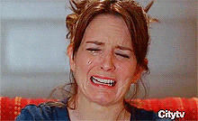
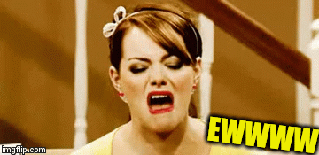
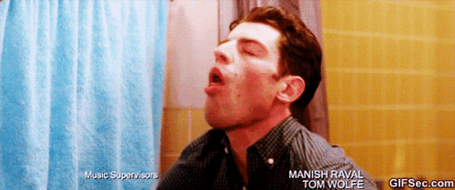
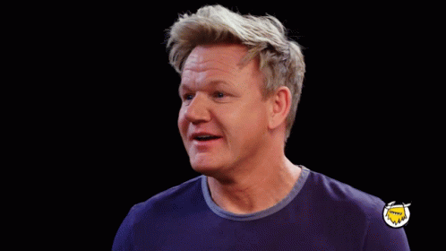
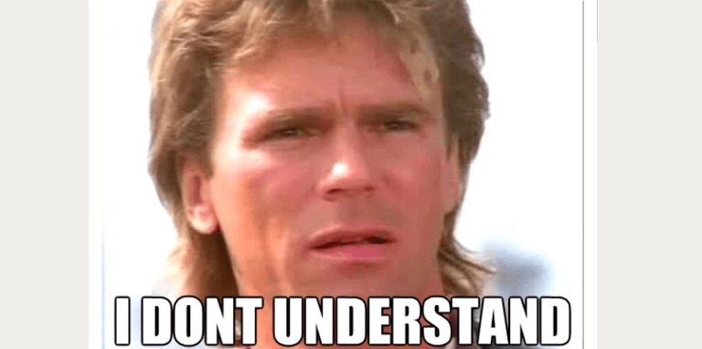
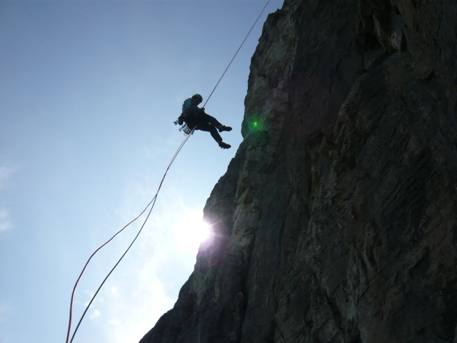
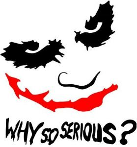
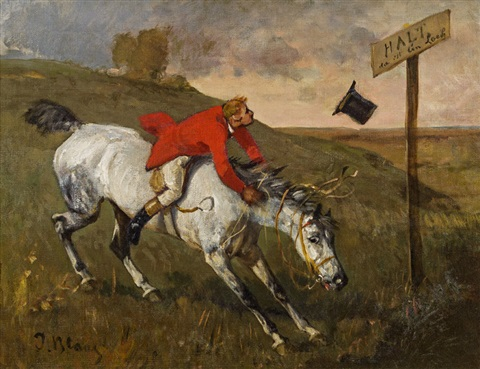
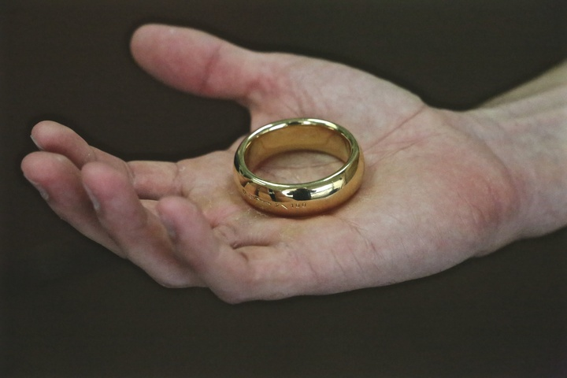

_I'll write my blog posts while watching "live" (a.k.a. on ABC or Roku the day after broadcast) - so it's my immediate reaction. Any subsequent notes or edits I'll highlight._

> My wife: I think he's going to end up alone.

Let's face it, the winner tonight is really whichever woman Matt *doesn't* pick.

## Prelude / preview

A blizzard.

A **shocking** conclusion.

Can he commit?

Matt's brother is already over it.

Matt's mum seems pretty over it, too.

And a preview of the "After the final rose"...which I'll recap later this week in another live watch.

## Matt states the obvious

If you haven't been watching the fucking season...

> It's the final week, and it's down to Michelle and Rachael.

He then says that Michelle is the perfect wife, and describes the quality of a pet dog (she's "loyal" and "smart"). And Rachael encourages him to be open, and he wants to bang her again.

## Family time

Matt is not the cool brother.

This must be so wild for the family at this point, listening to their family member talking in such a deranged manner about a future that's not going to happen with women that they've never met.

Like Matt's brother is *really* over it. And his mum doesn't think he's going to be engaged at the end of this.

## Michelle meets the folks

> Nice to "finally" meet you...

A weird comment from people who've only learned of Michelle's existence within the last ten minutes.

Why is Matt's mum crying already?

John is gonna "keep it real" with Michelle. And...

- he looks pretty doubtful when Michelle says that she thinks she can trust Matt
- that he's never seen Matt in a relationship before
- but that Michelle seems happy

Matt's mum thinks it's all "pretty neat"

- Matt gravitates to strong families, and that was "a blessing" because of her own broken home
- She cries some more...she's actually fairly incomprehensible

Michelle says a bunch of stuff about how she loves Matt and that she's not scared.

### Mom gives her assessment

She likes Michelle. Matt "likes" Michelle. Matt wants his mom's advice, and she likes to see him happy, when he could be sad instead.

She doesn't really provide him any actual advice.

Matt's leg grabbing thing apparently even extends to when he's sitting with his mom.

Then Matt and Michelle make out (eyes closed!), and they throw a couple of snowballs at each other before they leave.

*Commercial (I like Katy Sagal, but this show "Rebel" looks fucking awful)*

## And now time for Confederacy Rachael

She's found sunflowers to contrast with yesterday's blizzard.

Apparently Rachael requires coaching for his family, which Michelle didn't. Kinda feels like Matt knows his family would prefer Michelle, but he just wants to ~~fuck~~ marry Rachael.

Matt and Rachael talk about how open they are with each other, and how that's important (...though she hasn't talked about her "celebrate the South" party...).

John thinks there's a bit of a connection.

He grills Rachael...

- has she ever experienced true love?
- why is Matt husband material? (she goes slightly beyond the usual bland platitudes)

And mum's questions

- Can Rachael see herself "become engaged"? Which actually, given The Bachelor setup, has the right kind of implication about how passive a party Rachael would be in "becoming" engaged.
- Rachael is like a little girl describing a fairytale
- Matt apparently **prayed** over Rachael (...is that what we're calling fantasy suite fetishes, now)? And The Bachelor is "God's way" of putting the two of them together.

Matt's mum cries. Rachael does a bunch of really excessive gushing to camera.

## Family feedback

After the two family meetings, this seems pretty clearly set up that Confederacy Rachael has this in the bag...right? Those visits were totally presented that way. At least insofar as he's going to choose someone at all (I still think "Matt runs away from commitment" is a real contender).

Matt's going to spend the next few days "in prayer", so that he can remain in control of the process.

### Mum pushes back against all this "love" shit...

Mum likes both of them. She speaks in such an odd way.

But she's also very much "so, why wouldn't you just date someone for a bit?" and that love won't just "carry you through". So he dives straight into thinking whether he's ready or whether he'll be his dad.

John is pretty doubtful, too.

Essentially, they're both taking the entirely sensible stance that this show creates fucking stupid, artificial, toxic parodies of a real relationship, and that he probably shouldn't get engaged on that basis.

*Commercial*

## Matt's fantasy is crushed

There's a lot of pensive pacing. 

And so, of course, Matt needs to turn to a true expert for advice. It's Cancel Culture Chris!

His mum and brother speaking some sense has thrown him for a loop. He doesn't know...can he commit?

Chris is pretty much "woah, dude, that's a lot". And then tries to persuade Matt to not be lame. And Matt admits that he doesn't want to get engaged...

Which is;

a) good, sensible, smart

b) does anyone in the final stages of this show actually understand what the fucking show's premise is?

> Chris (unspoken): Are you fucking kidding? You're going to ruin the actual end point of this whole series. We should never have chosen a guy who hasn't been on The Bachelorette.

*Commercial*

## A date with Michelle

Matt's nervous about what they're gonna do...but they have matching jackets to do it.

They're going to rappel down the bland, uninspiring, facade of Nemacolin, to get to a table that's set up in the middle of a runway for some reason. There, they'll presumably not actually eat any of the food that's laid out.

Matt fucks up almost immediately, and ends up upside down, to unnecessarily dramatic music. And then he kinda fucks up again. He is...not graceful.

It doesn't look as graceful as this.

Matt is so bad at it, and yet continues to mansplain to Michelle how to do the thing that he's repeatedly fucking up.

**Why is there a sofa set up on a runway????**

### Did you like my family?

What kind of fucking answer does Matt expect? Michelle to say "actually, I hated your mom"?

So they just kinda babble about how nice everyone is, and some bland platitudes. 

Michelle has been prepped with a scripted question;

> Do you think you're here, ready to commit, emotionally?

**Seriously, why are they on a runway????**

*Commercial*

### In my head all day

This is gonna be the rest of the episode isn't it;

> I don't know

> I'm not sure if I'm gonna get there

> I'm not ready to commit

...repeat...

Meanwhile, Michelle has finally bought fully into the delusion that is The Bachelor, and says that she's going to spend her life with Matt.

Matt reiterates that his rappelling advice was totally uneducated mansplaining.

Michelle has gifts, as well as an inability to "picture herself leaving without you".

1. A shitty sports shirt with "Mr. James" on it.
2. A shitty sports shirt with "Mrs. James" on it, because they're a team.

Also, their shirts don't match. And why is she #2 on the shirt and he #1.

I can't decide if I like or hate Michelle's earrings. She looks very pretty tonight.

Michelle...if you can see "wheels turning" in Matt's brain then you're a better person than most of us.

Yes, Matt, doubt **is** scary. It's supposed to be.

But is his conclusion "I'm not entirely sure if I want to get engaged, so therefore I want to end things completely"? Because that's also stupid.

**Don't grab her leg now, dude, that's not comforting**

The music is so cheesy. I wonder if they have original composers.

Matt looks vexed as he walks through the really badly wallpapered corridors of Nemacolin, and Michelle sobs in a corner.

*Commercial*

Matt is still doing serious, emotional, pacing.

But not to worry...

Woke Police Chris is here and "we can chill" while he offers some very generic advice.

Matt's gotten seriously fucked up by his parents' break up. His mum said nothing profound at all, other than kinda highlighting that you shouldn't rush into marriage and that just love isn't enough.

Matt tells Chris (who didn't offer bad advice, if we're being fair) that he isn't sure if he's ready with Confederacy Rachael, either.

He's got a whole day to get clarity, though!

His pants still don't fit.

Matt leaves a tired looking Chris sitting on a curbside, as he seeks for "time".

## Rachael preps for her date

OK, her ass in those pleather jeans looks **amazing**.

But...Chris is leaning on the door in a weird kind of "hey, baby" stance, and...

There's no date, and Rachael is crushed. And, because she now knows about Matt's doubts, she doesn't even know if she'd say yes to him anyway!

## Jewelzzzz!

> I'm thinking about what it means to be a man.

So...uh..."Neil Lane" comes to visit.

Ooooh, he's the jeweller.

Neil asks if Rachael is expecting a ring, Matt gives him a bunch of bullshit about how she's expecting "honesty". And I feel like a jeweler would absolutely not give a flying fuck.

## Oooh, shiny

Matt's weirdly turned around by looking at some overly gaudy engagement rings, and he decides to keep one "just in case".

It doesn't seem to me that looking at rings should influence how confident he is about engagement as a whole.

It's gonna be really ironic that, after making a big deal about how important all the commitment is, and how he'll never ever want to take the ring off if he does give it to Rachael...he'll give it to Rachael and then they'll break up in three months.

## Emotional Rachael

There's lots of pensive, sad, close-ups of Rachael in her gray Target robe, bouncing around the garishly awful curtains of her room.

It's funny that all this supposed "pensive alone time" is filmed by what is clearly a couple of active cameramen, rather than any kind of automated contraption. So they're stepping around her carefully as she paces so anxiously.

## "Meet me at the lake"

Matt's decided to stumble around emotionally at the banks of a lake, looking incorrectly dressed for the terrain. Chris is also besuited, and quizzical.

Minor bet to myself - he will be stupid enough to propose.

Although we'll have to endure some more back-and-forth self analysis first. Matt "doesn't know" what he's going to do. 

...probably slip on the mud in those loafers as he makes his way to the weirdly incongruous artisan shack and roaring fire that's in the woods.

*Commercial*

## Rachael has even less appropriate footwear

That's a good color on her, though.

Could Chris Harrison's job be done by a robot? Maybe we'll find out next season.

Also, wasn't it snowing yesterday? Isn't that dress going to be freezing? You can see her breath.

> I've never wanted anything more in my life.

Which is sad. But does remind you how young Rachael is. 

Far too young to be getting married to a random guy from The Bachelor, at least.

She has a lot of emotional, needy, things to say to Matt. Emotional, but also like she's read them all in a storybook and rehearsed them.

Matt does his signature big exhale, because having to think about things makes him tired.

He's right into the fear of rushing in, and the dangers of how he might fuck up in future.

**NO PROPOSAL!!!**

Instead, he asks her if she wants to go steady. And they have a very awkward and not-seeming-like-in-love kiss.

They are not natural kissers.

Rachael accepts the rose, unsurprisingly, and they leave in a very stereotypical horse and carriage.

## Fin

I'll be doing a hatewatch of "After the final rose" later this week.

Prior to watching that, I'll wager that Matt and Rachael are *not* still together.